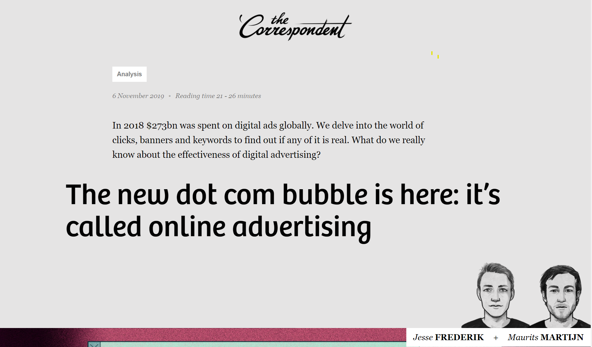
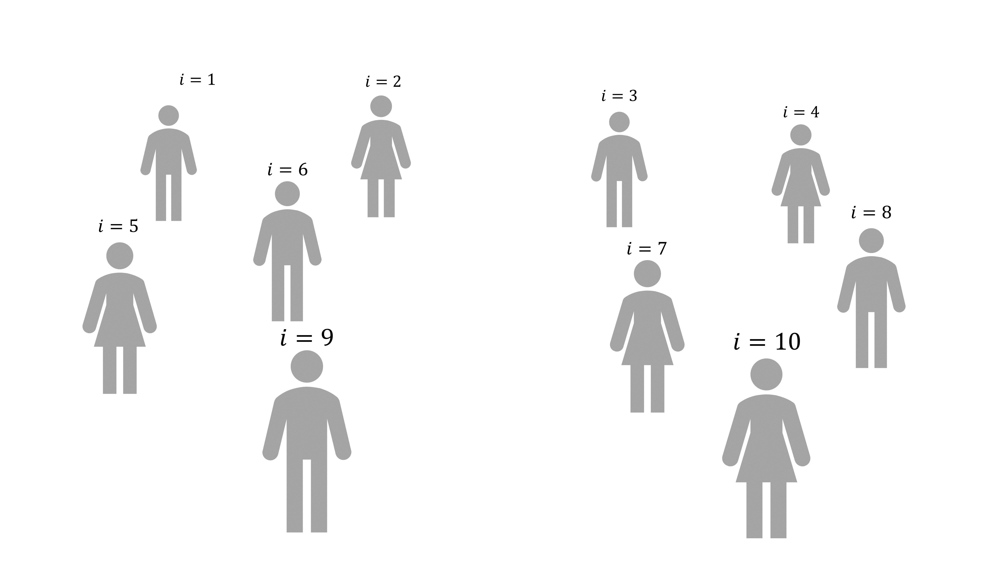
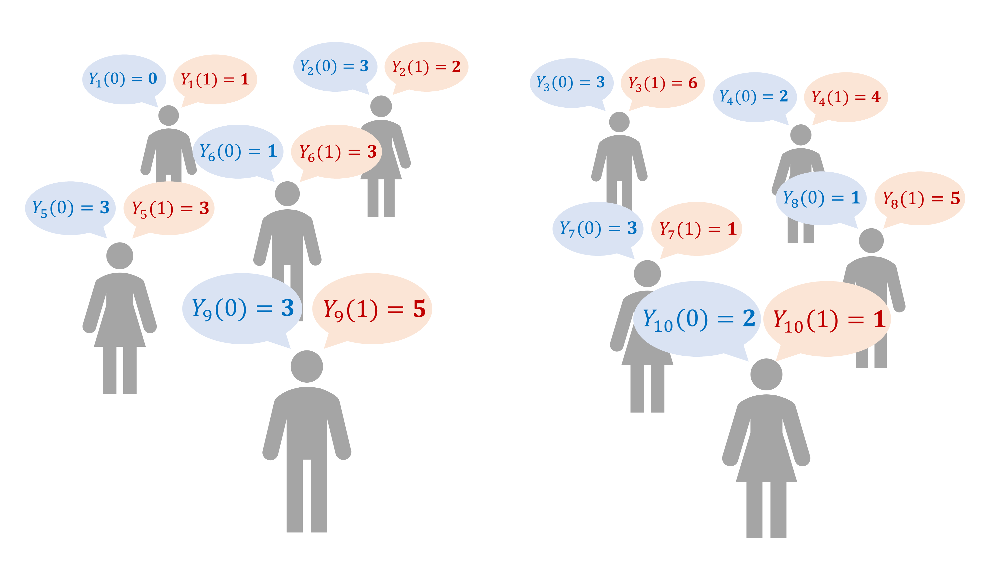
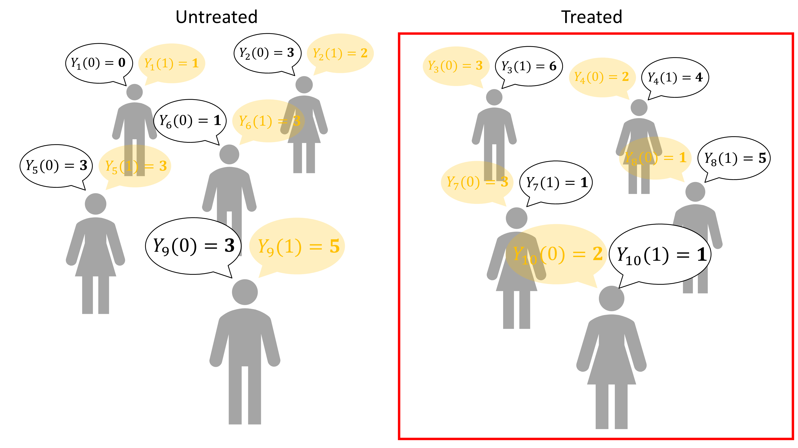
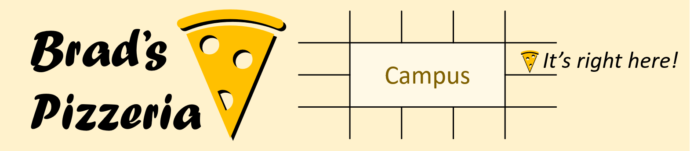
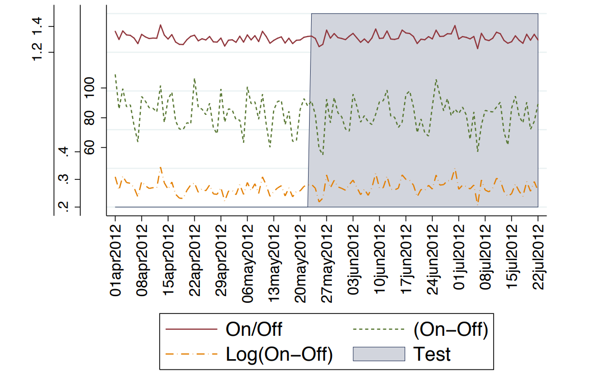

<link rel="stylesheet" type="text/css" href="http://tikzjax.com/v1/fonts.css">

**What is this course about?**

This course is about:

- How (and when) we can use data to learn about cause-effect relationships in the world (***"causal inference"***)
- How can we use causal concepts to make better decisions, particularly in business settings (***"causal reasoning"***)

***
**Big Questions:**

- What is "causality"? How is it different from correlation?
- Why does causality matter for decisionmaking?
- What is so special about randomized experiments?
- What do we do if we have data but can't run an experiment?
- How can we evaluate causal claims made by others?

# The New Dot Com Bubble

***
 

***
**Q:** What is your general reaction to the article?

- Do any of you have experience in marketing or want to work in marketing?
- Do you think that online advertising is effective? Why or why not?
- How is advertising effectiveness generally measured?

***
**Measuring Advertising Effectiveness (According to Google)**

1. Track "conversions" (e.g. sales, sign-ups, etc.) that occur after an ad is clicked
2. Calculate the "conversion rate" (conversions per ad click)
3. Calculate the Return on Investment (ROI) for the ad campaign as:
$$\text{ROI} = \frac{\text{Revenue} - \text{Cost}}{\text{Cost}}$$
Where "Revenue" is the total value of conversions and "Cost" is the total cost of the ad campaign.

 

 

**Q:** Is this a good measure of advertising effectiveness? Why or why not?

***
The article contrasts two main "effects":

- "*Advertising Effect*"
- "*Selection Effect*"

Let's talk about each of them.

***
**The "advertising effect"**

**Q:** What do the authors mean by the "advertising effect"?

***
**The "Selection effect"**

**Q:** What do the authors mean by "*selection effect*"? How does it lead companies to lose money on online advertising?

***
**Terminology:** We will use the term "*selection bias*" instead of "*selection effect*".

 

*Selection bias is not a causal effect.*

***
**Defining "Causal"**

In this class, we will define causation in relation to a specific ***intervention*** and a specific ***outcome*** within a system.

- By "system", I mean a collection of variables and relationships between those variables
- An ***intervention*** is a change in the value of a variable that is not driven by the normal dynamics of the system
- A ***causal effect*** is the difference between the outcome with and without the intervention.

# Potential Outcomes & Counterfactuals

***
The ***Potential Outcomes Causal Model (PO)*** is a popular framework for analyzing causal relationships.

- The PO model clarifies causal relationships by explicitly describing ***observed*** and ***counterfactual*** outcomes for one variable
- It also builds in some subtle *assumptions* about the nature of those outcomes

***
**Treatment and Outcome**

PO considers the causal effect of an intervention (called a "***treatment***") on a specific ***outcome*** variable.

- We assume we can observe a population of units of observation (individuals, organizations, products, etc.) indexed by $i=1,2,3, \dots ,N$
- I will use $D_i$ to indicate the treatment status of unit $i$, and $Y_i$ to indicate the observed outcome.
- In the simplest case, treatment is binary: each unit is either ***treated*** ($D_i = 1$) or ***untreated*** ($D_i = 0$)

***

A population of units $i=1,2,3,\dots,10$.

***
**Potential Outcomes**

- A potential outcome $Y_i(D)$ indicates the outcome that would occur if unit $i$ receives treatment $D$.
- For example, with binary treatment, we have two potential outcomes:
    - $Y_i(1)$ is the potential outcome that occurs if unit $i$ is treated
    - $Y_i(0)$ is the potential outcome that occurs if unit $i$ is *not* treated

*Watch out:* "Potential outcomes" does *not* mean "the range of values that $Y$ can take". 

***

With binary treatment, each unit has two potential outcomes (we cannot observe them directly). Every unit can have different potential outcomes.

***
**Observed and Counterfactual Outcomes**

- We only ever observe ***one*** potential outcome for each unit
- For example, for unit $i$, if $D_i=1$, we observe $Y_i(1)$ but not $Y_i(0)$
- The potential outcomes that we do not observe are called ***counterfactual*** outcomes (or collectively "*counterfactuals*")

***

When treatment is assigned, one potential outcome is observed for each unit (black). The others become counterfactuals (orange).

***
**Causal Effects**

We define the causal effect of treatment for each unit as the *difference* between the treated and untreated potential outcomes.

I will use $\delta_i$ indicate the causal effect of the treatment on unit $i$, defined as:

$$ \delta_i = Y_i(1) - Y_i(0) $$

***

In this picture, each unit's treatment effect is the difference between its treated and untreated outcome.

***
**The Fundamental Problem of Causal Inference**

To directly measure a causal effect we would need to be able to observe both:

1. What *did* occur (the observed outcome)
2. What *would have* occurred if the treatment were different (the counterfactual).

 

*This can never happen!*

# Flyers at the Pizzeria

***
**Activity:** It's the first week of classes, and I need some help running an marketing campaign for *Brad's Pizzeria*. 

- It's located on the edge of campus, so I know there are a lot of potential customers around. The problem is that not many students seem to know it exists.
- I'm going to run a marketing campaign where I have someone hand out paper flyers to students in the area. Each flyer will have a map directing students to the pizzeria.

***Any volunteers to help me run my campaign? ***

***
***Worth it?***

 

**Q:** Can I tell if the flyer campaign will be worthwhile? What do I need to know?

***
**Potential Outcomes Notation:**

Suppose I want to know the effect of *receiving a flyer* on the quantity of *slices of pizza sold*.

- $Y_i$: Number of slices of pizza you will purchase from Brad's Pizzeria
- $D_i$: Whether or not you receive a flyer 
  - $D_i=1$: Flyer
  - $D_i=0$: No Flyer

 

**Q:** 

- What do $Y_i(0)$ and $Y_i(1)$ mean in this context?
- What is your individual treatment effect?

***
**Some additional assumptions:**

- The cost of the flyer campaign is $1 per flyer
- The profit on each slice of pizza is $1
- People in the first two rows are "*in line*". This is the only information available when deciding who to give flyers to.
- We will start by computing the ROI of a flyer campaign as:

$$ \text{ROI} = \frac{\text{Total Sales to those with Flyers} - \text{Flyers}}{\text{Flyers}} $$

***
**Advertising Strategies**

Let's try running some different advertising campaigns and see what happens.

1. Flyers to everyone
2. Flyers to those in line
3. Flyers to those *not* in line

***
**"ROI" vs ROI**

**Problem:** Our (Google's?) naive ROI calculation assumes that people who receive flyers would not have bought pizza without the flyer. 

**Q:** What do we actually need to know to estimate the true ROI of the flyer campaign?

***
**ROI is fundamentally a *causal* concept**

- To know the true benefit of the each campaign we need to know how many *additional* slices of pizza were sold *because of* the flyer campaign.
- We can compute this if we know the *causal effect* of the flyer campaign on each individual.
$$ \text{True ROI} = \frac{\sum_{i=1}^N \delta_i - \text{Flyers}}{\text{Flyers}}$$

- Equivalently, we can compute total sales that would occur if no flyers were given out, and compare that to the total sales that actually occurred.

***
**Things to think about:**

- Can you ever compute the true ROI of a marketing campaign as we just did?
- What happens if advertisers focus on maximizing the naive conversion-based "ROI" instead?

***
**The Stable Unit Treatment Value Assumption (SUTVA)**

Defining causal effects as the difference between their potential outcomes requires that the potential outcomes $Y_i(1)$ and $Y_i(0)$ are fixed, regardless of how treatment is assigned. 

This assumption is called the *Stable Unit Treatment Value Assumption (SUTVA)*

**Q:** Does SUTVA seem realistic in the Pizzeria example?

# Back to Steve Tadelis and eBay

***
**Q:** How did Steve Tadelis convince eBay that they were wasting money on keyword ads?

***
**Difference in total sales between treated and untreated regions**

***
**Who is using Causal Inference?**:

\centering

{ height=250px }

***
**Causal Inference Applications in Business**

- **Netflix:** What is the effect of restricting password sharing on total subscription revenue?
- **Tesla:** What is the effect of using the Autopilot feature on the probability of being in an accident?
- **Amazon:** What is the effect of using air-shipping on sales for a particular product?
- **Microsoft:** What is the effect of adding AI to Bing Search on monthly users?
- **Airbnb:** What is the effect of having a professional photo on rental demand?
- **Spotify:** What is the effect of changing the recommendation algorithm on user engagement?
- **TD:** What is the effect of an employee training program on productivity?

***

***Let's take a break***

***
**Before the break, we:**

- Explored the problem of causality in online advertising
- Defined causality in in terms of an *intervention* and an *outcome*.
- Introduced Potential Outcomes framework:
    - Potential Outcomes
    - Treatment
    - Observed Outcomes
    - Counterfactual Outcomes

***
**Quick Review:**

- What is a *"Potential Outcome"*?
- What is an *"individual treatment effect"*?
- What is the *fundamental problem of causal inference*?

***
**Example:**

\centering

{width=80%}

**Q:** Did the tariffs affect stock prices? What do we need to know?

***
**Causal Effects**

We define the causal effect of treatment for each unit as the *difference* between the treated and untreated potential outcomes.

I will use $\delta_i$ indicate the causal effect of the treatment on unit $i$, defined as:

$$ \delta_i = Y_i(1) - Y_i(0) $$

***

In this picture, each unit's treatment effect is the difference between its treated and untreated outcome. *One of these is always a counterfactual*.

***
**The Fundamental Problem of Causal Inference**

To directly measure a causal effect we would need to be able to observe both:

1. What *did* occur (the observed outcome).
2. What *would have* occurred if the treatment were different (the counterfactual).

 

*This can never happen!*

# Intro to R

***

**Back to the Pizzeria**

let's refresh our memories:

- What was the scenario?
- What did we learn?

***
**R Demo: `PizzeriaDemo.Rmd`**

 

**Goals:**

- Introduce R, RStudio, and RMarkdown
- Simulate some data that tells a causal story
- Think about how to run a better marketing campaign

