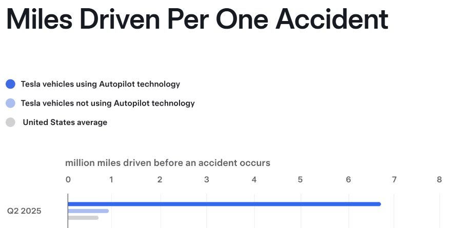
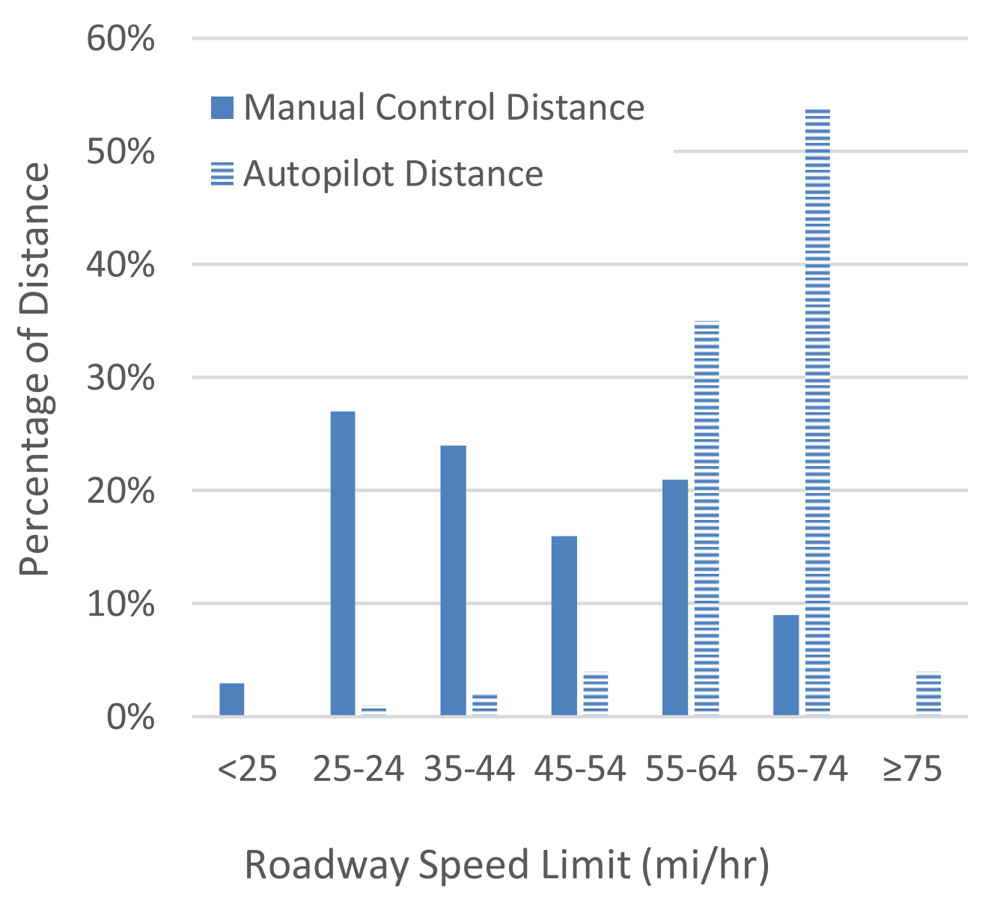
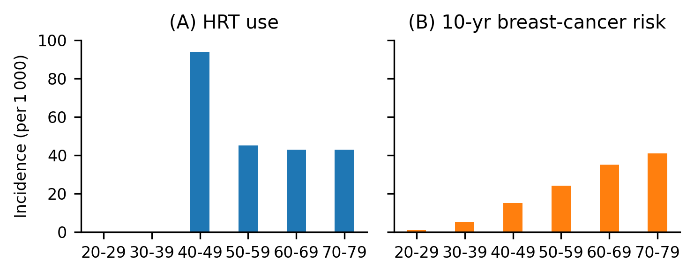
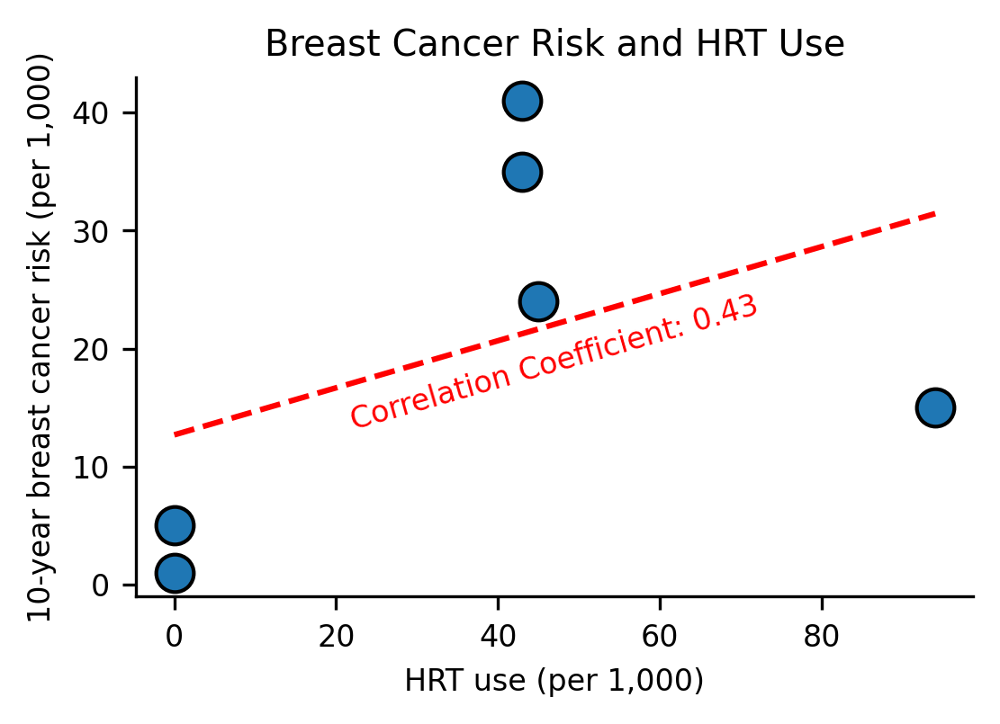
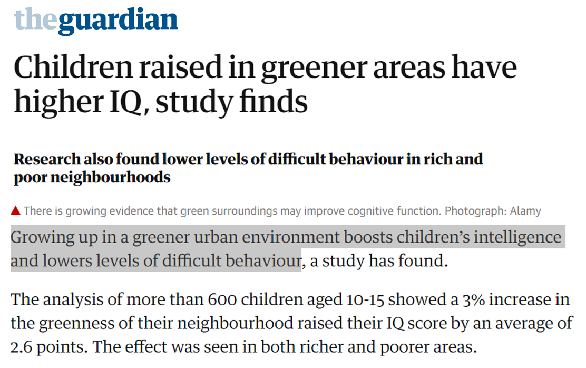
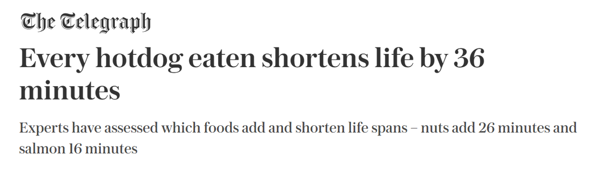
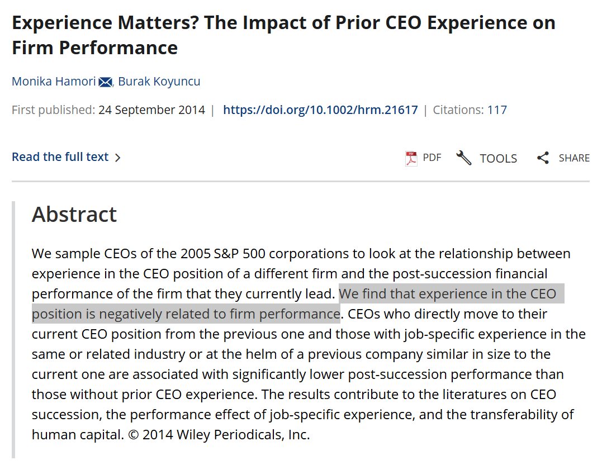
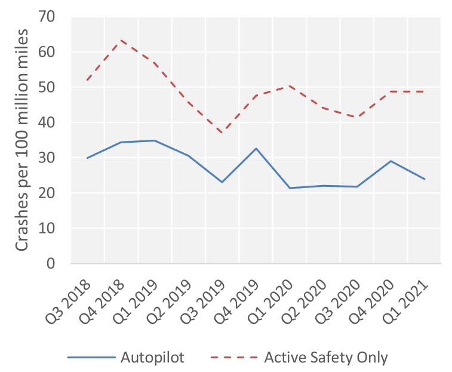
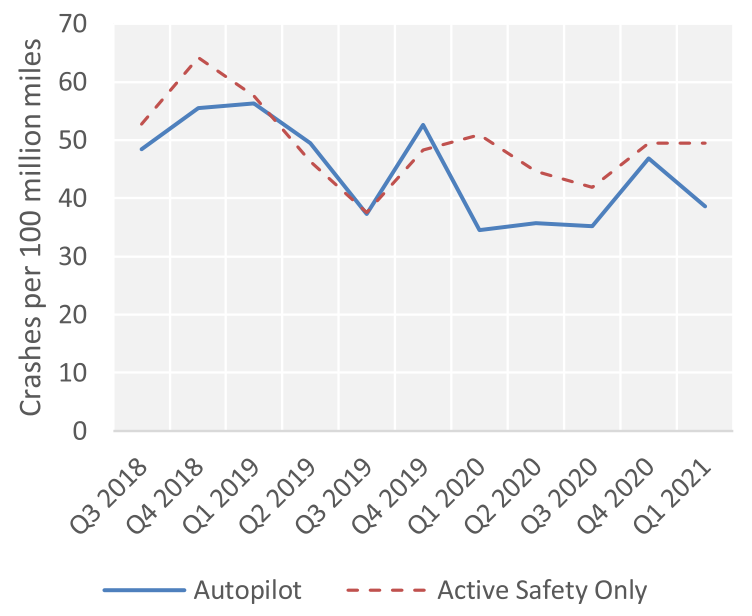

<link rel="stylesheet" type="text/css" href="http://tikzjax.com/v1/fonts.css">

**Previously:**

- Explored the problem of causality in online advertising
- Defined causality in in terms of an *intervention* and an *outcome*.
- Introduced Potential Outcomes framework:
    - Potential Outcomes
    - Treatment
    - Observed and Counterfactual Outcomes
- Ran our first simulated experiment in R

***
**Agenda:**

- Confounding:
  - Tesla Autopilot Safety
  - Directed Acyclic Graphs
  - Confounders
  - R Demo
- Mediators, Colliders, and More

# Case Study: Tesla Autopilot Safety

***
**Background:**

- Tesla's Autopilot feature is a semi-autonomous driving system that can take over some driving tasks from a human driver.

- Starting in 2018, the National Transportation Safety Board (NTSB) investigated a series of fatal accidents involving Tesla vehicles that were using Autopilot. The board concluded that Autopilot system was partly defective.

- In 2023,  Tesla was required to "recall" the system and make software updates in over 2 million vehicles.

- The updates added additional alerts and monitoring that force drivers to pay more attention to the road while using Autopilot, essentially reducing the level of automation.

***

- In December of 2023, Tesla responded to news articles about the recall with a lengthy tweet defending the safety of their systems:

*"it is morally indefensible not to make these systems available to a wider set of consumers, given the incontrovertible data that shows it is saving lives and preventing injury."*

***

Tesla's central claim: 

*"The more automation technology offered to support the driver, the safer the driver and other road users. "*

***
Tesla's evidence for Autopilot safety:

**Q:** Is this evidence convincing? Why or why not? (take 5 min)

***

Thinking Causally:

1. What is the causal claim that Tesla is making? (what are the treatment and outcome variables?)
2. What is an "observation" in this context?
2. What are the potential outcomes for a given observation? What is observed and what is counterfactual?

***
**Alternative Causal Stories**

Evaluating causal claims requires asking whether there are alternative stories that could explain the data we see.

These alternative stories will still be causal, but they will involve *different* causal relationships between the variables in the system and imply different counterfactual outcomes.

They will often involve additional variables that we haven't yet considered.

***
Let's introduce a new tool for thinking about causal stories involving multiple variables: **Directed Acyclic Graphs** (DAGs)

# Directed Acyclic Graphs

***
**Directed Acyclic Graphs (DAGs)**
DAGs are a graphical system for describing and reasoning about causal systems.

- Originally developed by Judea Pearl to help improve the ability of robots to reason about the world
- Now an important tool for helping humans to reason about the world

***
DAGs represent causal relationships between random variables as arrows between nodes.

<!--beamer:\begin{center}-->

<!--beamer:\end{center}-->

- Each variable in the system is a node
- Every direct causal relationship between a pair of variables is drawn as an arrow

***
Directed Acyclic Graphs impose three restrictions on the causal model:

1. **Directed:** Causal relationships only go in one direction between nodes (no simultaneity)
2. **Acyclic:** No cycles/loops in the graph
3. **Conditional Independence:** Variables are statistically independent except for the relationships indicated by arrows in the graph.

***
**Interpretation:**

- Restrictions 1 and 2 imply that a variable can never have a causal impact on itself.
- The conditional independence assumption means that all statistical relationships between variables result from their causal connections.

***
**Comment:** The conditional independence assumption reflects Judea Pearl's view is that *all* correlations are ultimately generated by causal relationships.

<!--beamer:\begin{center}-->

<!--beamer:\end{center}-->

Pearl would say that a correlation between two variables doesn't necessarily imply that one *causes* the other, but it does imply that the variables must be connected by *some* chain of relationships in a causal network.

***
**The importance of absence in DAGs**

- The conditional independence assumption allows us to use the graph structure analyze which causal relationships can be estimated from which data (extremely useful!)
- It is also a very *strong* assumption. Every possible pairwise relationship must be considered carefully when constructing a DAG.

<!--beamer:\begin{center}-->

<!--beamer:\end{center}-->

***
**Using DAGs in the Autopilot example**

Draw a DAG that expresses Tesla's causal model of Autopilot safety.

- What are the key variables in the system?
- What are the causal relationships between these variables?

***

A simple DAG representing Tesla's claim:

\vspace{2cm}

<!--beamer:\begin{center}-->

<!--beamer:\end{center}-->

***

Can you think of alternative causal stories that could explain the data we see?

How would you represent these stories as DAGs?

***

Try to come up with at least **two alternative stories** that could explain this data.

Work with a partner to draw a DAG for each story.

***

Does this data give you any ideas for alternative stories?

***
Here is a story about highway driving that could explain the data:

\vspace{1.5cm}

<!--beamer:\begin{center}-->

<!--beamer:\end{center}>-->

Can you see how?

# Confounders

***
**DAG Terminology:**

- A ***path*** is a sequence of nodes that are connected by arrows (direction doesn't matter)
- We say node $X$ is a...
  - ***parent*** of $Y$ if there is an arrow $X \rightarrow Y$
  - ***child*** of $Y$ if there is an arrow $Y \rightarrow X$
  - ***descendent*** of $Y$ if you can get from $Y$ to $X$ by following a sequence of arrows in the correct direction.
  - ***ancestor*** of $Y$ if you can get from $X$ to $Y$ by following a sequence of arrows in the correct direction.

***
**Definition:** We call variable $X$ a ***confounder*** if it is an ancestor of both $D$ and $Y$.

Example:

<!--beamer:\begin{center}-->

<!--beamer:\end{center}-->

Confounders can generate a statistical relationship between $D$ and $Y$ that is observationally equivalent to a direct effect $D \rightarrow Y$.

***
**Example:** Hormone Replacement Therapy (HRT) is a treatment for menopausal symptoms that was widely prescribed in the 1990s and early 2000s. However, a large study in 2003 found that women who were prescribed HRT had a higher risk of breast cancer. Later studies argued that this result was not entirely causal (though HRT may still affect breast cancer risk). 

***
What does this data suggest about the relationship between HRT and breast cancer risk?

 

\centering

***
Here's what happens when you plot HRT use against breast cancer risk using this data:

\centering

***
Here's what happens when you plot HRT use against breast cancer risk using this data:

\centering

***
**Summary of the HRT example:**

- Both HRT and breast cancer risk increase with age (Age is a confounder)
- Even if HRT did not cause breast cancer, the correlation between HRT and breast cancer risk would still be very strong.
- This makes it hard to measure the true effect of HRT on breast cancer risk.
- *Solutions* (we will see later):
  - Run a randomized controlled trial (RCT)
  - Control for age in the analysis

***
**Spot a confounder**

Let's play a quick game. I'll show you three newspaper headlines that involves some sloppy causal inference. For each headline let's,

1. Identify the (potentially) causal relationship being described. What are the treatment and outcome variables? Potential outcomes?
2. Try to think of a confounding variable that could explain each result

***
***Treatment? Outcome? Can you think of a confounder?***

<!-- 
***
***Treatment? Outcome? Can you think of a confounder?***

 -->

***
***Treatment? Outcome? Can you think of a confounder?***

***
***Treatment? Outcome? Can you think of a confounder?***

***
**Key idea:**

- Confounders are variables that have an effect on both *who is treated* and *what the outcome is*.
- Confounders can create correlations in our data that look like causal effects but aren't.

***
**R Demo: `Autopilot_blank.Rmd`**

 

**Goals:**

- Simulate data that matches a DAG
- Demonstrate how confounders can create correlations that look like causal effects

***
Suppose *this* story is true:

\vspace{1cm}

<!--beamer:\begin{center}-->

<!--beamer:\end{center}>-->

Can data on Autopilot and Accidents alone tell us about the causal effect between these variables? What if we have data on the road type too?

***
**Preview of a key idea**

If we have data on confounders we can control ("control") for them in our analysis.

Here are some results from a study^[Noah Goodall, 2023. *Normalizing crash risk of partially automated vehicles under sparse data*, Journal of Transportation Safety & Security] that controls for road classification (i.e., whether the car was driving on a freeway or not).

***
\center
**Crashes Per Mile with and without Autopilot**

***
\center
**Crashes Per Mile** ***Controlling for Road Classification***

***
**Strategic Selection**

**Comment:** Confounding is particularly important when we are trying to understand the behavior of strategic decision-making agents like people and organizations.

Decisionmakers often have some degree of foresight, and choose outcomes based on their expectation of the outcome. Furthermore, *they often have better information about their situation than we do*. This is a kind of confounder that we may never be able to fully measure.

We need to be very cautious about inferring causality when treatment is a choice.

# Mediators, Colliders, and More

***
Not all variables that are correlated with both $D$ and $Y$ are confounders.

DAGs can get very complex, but there are two types of variables that are worth mentioning specifically:

- ***Mediators***
- ***Colliders***

***

**Mediators**

A ***mediator*** is a variable that is a descendant of $D$ and an ancestor of $Y$.

Example:

<!--beamer:\begin{center}-->

<!--beamer:\end{center}-->

***

**Colliders**

A ***collider*** is a variable that is a descendant of both $D$ and $Y$.

Example:

<!--beamer:\begin{center}-->

<!--beamer:\end{center}-->

***
**Challenges for Measuring Causal Relationships:**

Confounders, Colliders, and Mediators (as well as any variable with a single causal connection to $D$ or $Y$)  will all be correlated with both $D$ and $Y$.

Therefore, we can't even tell from these correlations alone whether a third variable is a confounder!

 

**A common theme:** *We need to use domain knowledge to understand the plausible causal relationships in the system.*

