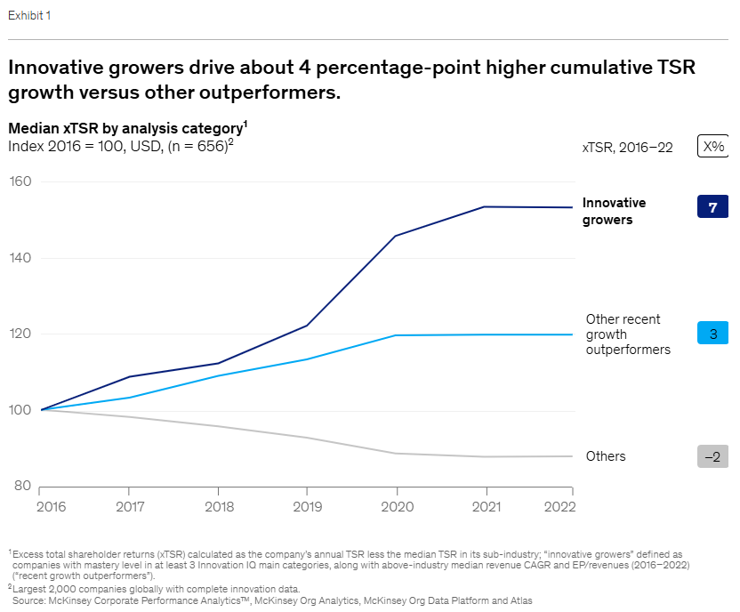
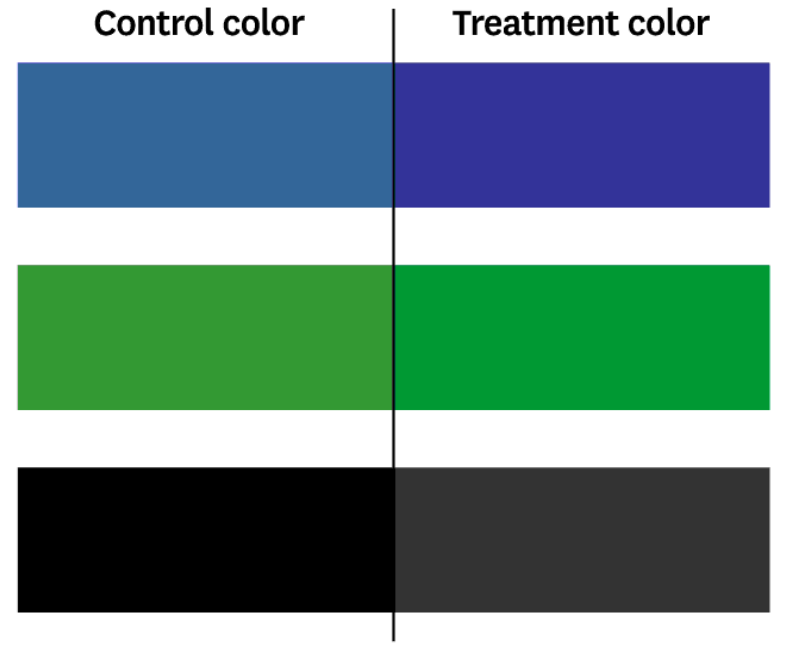
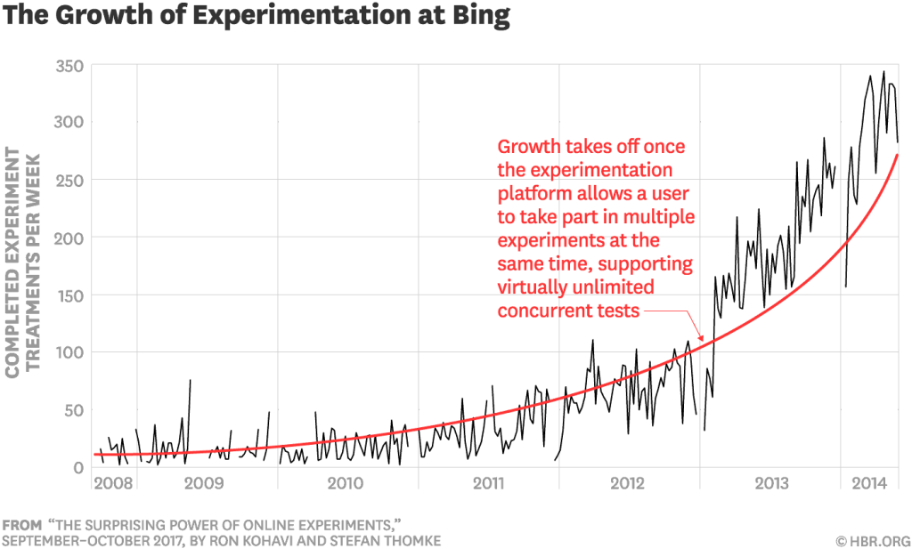
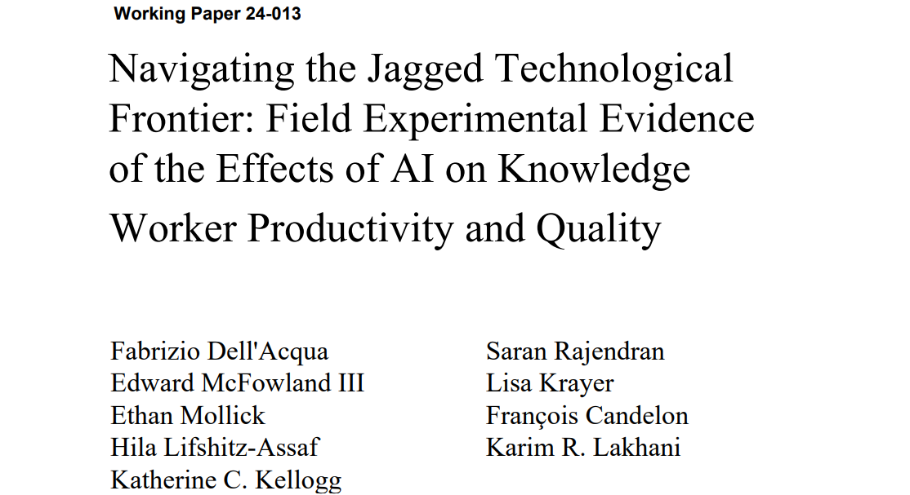
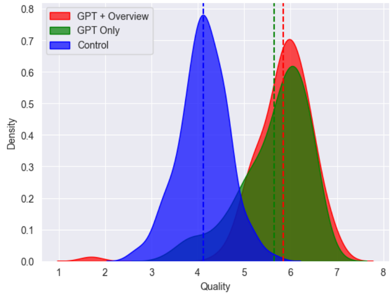
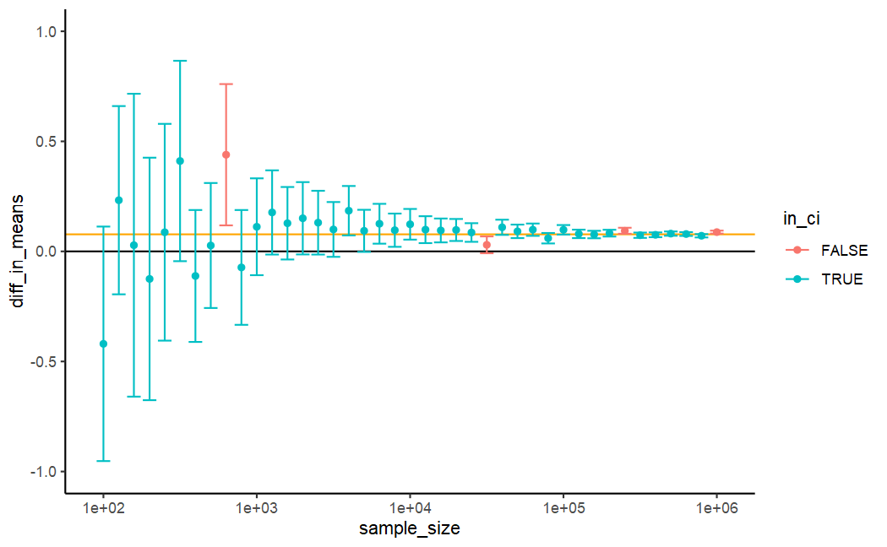
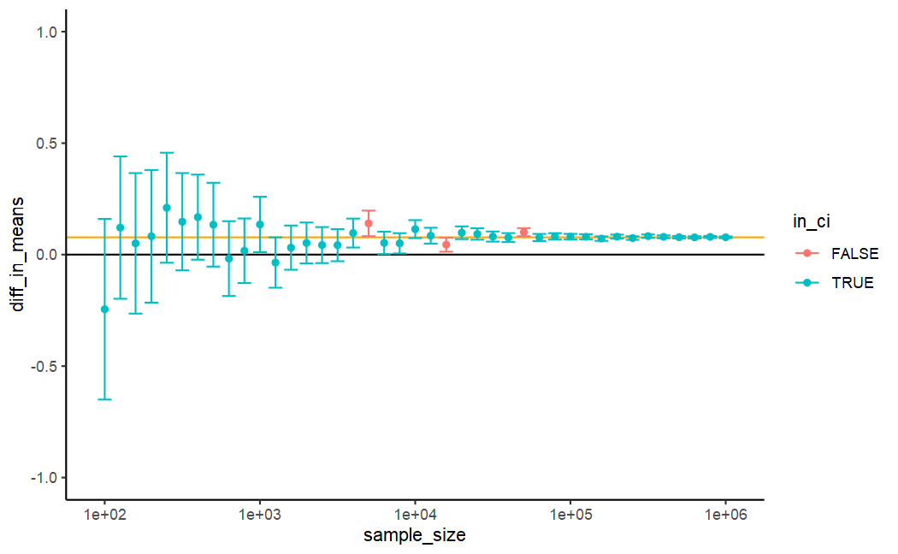

<link rel="stylesheet" type="text/css" href="http://tikzjax.com/v1/fonts.css">

**Agenda:**

- Intro to Experiments for Causal Inference
  - A/B tests + The Jagged Frontier experiment
  - Average Treatment Effects
  - Estimating ATE under random assignment
  - R Exercise

# Warm Up

***

***

**Q:** Is this a causal claim? Does it matter?

***
\center

**Q:** Is this convincing evidence of a causal effect?

***
**Definition:** We call variable $X$ a ***confounder*** if it is an ancestor of both $D$ and $Y$.

Example:

<!--beamer:\begin{center}-->

<!--beamer:\end{center}-->

Confounders can generate a statistical relationship between $D$ and $Y$ that is observationally equivalent to a direct effect $D \rightarrow Y$.

# Intro to Randomized Experiments

***
**Q:**

- What is an A/B test?
- Can you give some examples from the HBR article?

***
\center
Apparently this A/B test was worth $10 million/year.

***
\center
...Which might explain why A/B tests have become so common.

***
**Randomized Experiments**

A randomized experiment is a study where:

- Experimenters *intervene* to change the treatment status of units in the study
- Experimenters choose the treatment status of each unit *randomly*

This approach to measuring causal effects is also  known as a "randomized control study" in medicine, or an "A/B test" in the tech industry.

***
\center
**An example of a randomized experiment:**

***
**Abstract:** The public release of Large Language Models (LLMs) has sparked tremendous interest in how humans will use Artificial Intelligence (AI) to accomplish a variety of tasks. In our study conducted with Boston Consulting Group, a global management consulting firm, we examine the performance implications of AI on realistic, complex, and knowledge-intensive tasks. 

...

***
The pre-registered experiment involved 758 consultants comprising about 7% of the individual contributor-level consultants at the company. After establishing a performance baseline on a similar task, subjects were randomly assigned to one of three conditions: no AI access, GPT-4 AI access,
or GPT-4 AI access with a prompt engineering overview. 

...consultants using AI were significantly more productive (they completed 12.2% more tasks on average, and completed tasks 25.1% more quickly), and produced significantly higher quality results (more than 40% higher quality compared to a control group).

***
\center
**Main results**

***
**Big Question**

Do randomized experiments always estimate a causal effect?

..and if so, how do they overcome the *Fundamental Problem of Causal Inference*?

***
\center
How seriously should we take a result like this?

***
How would your interpretation of this plot change if you knew that each employee got to choose whether to use the AI system?

***
**Randomized Experiments as a DAG**

Deliberate randomization of treatment *changes the structure of the DAG*. If treatment is controlled by the experimenter, then then all arrows pointing to treatment are removed.

<!--beamer:\begin{center}-->

<!--beamer:\end{center}-->

The practical challenge of experimental design is to ensure that treatment is randomized without altering the causal effect you want to measure.

***
**Experiments and Average Treatment Effects**

Another perspective on how experiments work is that instead of trying to directly measure individual treatment effects $\delta_1,\delta_2,\delta_3,\dots,\delta_N$ (which is impossible), experiments estimate the *Average Treatment Effect*  for these units.

This lets us to use information about one treatment group to predict the *average* counterfactual for another and overcome the *Fundamental Problem of Causal Inference*.

# Average Treatment Effects

***
**Average Treatment Effect**

The *Average Treatment Effect (ATE)* for a population is expected value of the all the individual treatment effects:

$$ \begin{aligned}
ATE &= E[\delta_i] \\
    &= E[Y_i(1)] - E[Y_i(0)]
\end{aligned} $$

***
We are also often interested in the average treatment effect for certain sub-populations. Two important examples:

- ***Average Treatment Effect for the Treated (ATT):*** $$ \begin{aligned} ATT &= E[\delta_i|D_i=1] \\ & = E[Y_i(1)|D_i=1] - E[Y_i(0)|D_i=1] \end{aligned} $$

- ***Average Treatment Effect for the Untreated (ATU):*** $$ \begin{aligned} ATU &= E[\delta_i|D_i=0] \\ &= E[Y_i(1)|D_i=0]-  E[Y_i(0)|D_i=0] \end{aligned} $$

***
**ATE is combination of the ATT and ATU**

Note that we can use the law of iterated expectations to decompose the ATE into a weighted average of the ATT and ATU:

$$\begin{aligned}
ATE =& E[\delta_i] \\
=& E[\delta_i|D_i=1] P(D_i=1) + E[\delta_i|D_i=0]P(D_i=0) \\
=& ATT * P(D_i=1) + ATU * P(D_i=0)
\end{aligned}$$

***
**Average Treatment Effects and Counterfactuals**

Note that every average treatment effect is defined using the expected value of counterfactual outcomes (orange):

$$\begin{aligned}
ATT &= E[Y_i(1)|D_i=1] -\color{cf} E[Y_i(0)|D_i=1] \\
ATU &= \color{cf} E[Y_i(1)|D_i=0] \color{black} - E[Y_i(0)|D_i=0] \\
\end{aligned} $$

# Estimating Average Treatment Effects under Random Assignment

***
**Law of Large Numbers**

The Law of Large Numbers tells us that the mean of a random sample will converge to the expected value of the population as the sample size grows.

$$\overline Y = \frac{1}{N} \sum_{i=1}^N Y_i \rightarrow E[Y] \text{ as } N \rightarrow \infty$$

This allows us to estimate expected values with sample means.

***
**The Key Idea**

When treatment is randomly assigned, we can use the observed outcomes of one treatment group to estimate the counterfactual outcomes for the other.

We do not observe individual treatment effects, but we can use the Law of Large Numbers to estimate the *average* potential outcomes in the population.

Then we can compute the ATE as the difference between these averages.

***
**Example: Estimating the ATT**

Suppose that we want to estimate the ATT:

$$ATT = E[Y_i(1)|D_i=1] - \color{cf} E[Y_i(0)|D_i=1]$$

We can break the problem into two parts:

- Estimating the expected treated outcomes for the treated units: $E[Y_i(1)|D_i=1]$
- Estimating the expected untreated outcomes for the treated units: $\color{cf} E[Y_i(0)|D_i=1]$

***
**Estimating $E[Y_i(1)|D_i=1]$**

Recall that we can estimate an expected value with a sample mean. So, we can estimate $E[Y_i(1)|D_i=1]$ with the mean $Y_i(1)$ for the treated units in the sample, which I will write as $\overline Y_T(1)$:

$$E[Y_i(1)|D_i=1] \approx \overline Y_T(1)$$

Note that every number needed to compute $\overline Y_T(1)$ is *observable*. We can compute it directly.

***
**Estimating $\color{cf} E[Y_i(0)|D_i=1]$**

Estimating $\color{cf} E[Y_i(0)|D_i=1]$ is more difficult. We can define a similar estimator as before where we compute the mean of the $Y_i(0)$ values for the treated population:

$$\color{cf} E[Y_i(0)|D_i=1] \color{black} \approx \color{cf} \overline Y_T(0)$$

However, $\color{cf} \overline Y_T(0)$ is an average of *counterfactual outcomes*. So this estimator is impossible to implement.

We are going to need to make some assumptions.

***
**Random Assignment Assumption**

When treatment is assigned randomly it is *statistically independent* of the potential outcomes.

This implies that learning about a unit's treatment status does not tell you anything about it's potential outcomes.

Therefore, for any potential outcome $Y_i(d)$ and treatment $D_i$: 

$$E[Y_i(d)|D_i] = E[Y_i(d)]$$

*This is an "assumption" because it is never directly testable.*

***
**Key Result:** When treatment is randomly assigned, we can use the observed outcomes of one treatment group to estimate the counterfactual outcomes for the other.

$$\begin{aligned}
\color{cf} E[Y_i(1)|D_i=0] \color{cfm} = E[Y_i(1)] \color{black} &= E[Y_i(1)|D_i=1] \approx \overline Y_T(1) \\
\color{cf} E[Y_i(0)|D_i=1] \color{cfm} = E[Y_i(0)]  \color{black} &= E[Y_i(0)|D_i=0] \approx \overline Y_U(0)
\end{aligned}$$

This allows us to estimate any average treatment effect.

***
**Example: Estimating the ATT with random assignment**

If treatment is randomly assigned, we can use the observed outcomes for the untreated group $\overline Y_U(0)$ as an estimate of the counterfactual outcomes for the treated group:

$$\begin{aligned}
\color{cf} E[Y_i(0)|D_i=1] \color{black} = E[Y_i(0)|D_i=0] \approx \overline Y_U(0) \\
\end{aligned}$$

Therefore:
$$\begin{aligned}
ATT &= E[Y_i(1)|D_i=1] - \color{cf} E[Y_i(0)|D_i=1] \\
& \approx \overline Y_T(1) - \overline Y_U(0)
\end{aligned}$$

***
**Estimating other Average Treatment Effects**

If you use the same reasoning to estimate the ATU, or ATE you will find that under random assignment:
$$\begin{aligned}
ATT & \approx \overline Y_T(1) - \overline Y_U(0) \\
ATU & \approx \overline Y_T(1) - \overline Y_U(0) \\
ATE & \approx \overline Y_T(1) - \overline Y_U(0)
\end{aligned}$$

These are all the same estimate! (Try it yourself)

This result occurs because randomization means that there are no systematic differences between the potential outcomes in different treatment groups. Therefore, the ATE, ATT, and ATU must all be equal.

***
**Difference-in-Means Estimator**

Estimating causal effects with the difference in mean outcomes comes up over and over again in causal inference. I'll refer to it as the *Difference-in-Means Estimator* and indicate an estimate from this estimator with the symbol $\Delta \overline Y$.

$$\Delta \overline Y = \overline Y_T(1) - \overline Y_U(0)$$

***
\center
Can you see the difference-in-means estimate ($\Delta \overline Y$) on this plot?

***

**R Demo: `ExperimentsAndATE.Rmd`**

Goals:

- Simulate a randomized experiment
- Estimate ATE with the difference-in-means estimator

***
**Why Randomized Experiments Work**

Randomized experiments are the "gold standard" for causal inference.

- When treatment is assigned independently of potential outcomes, we can estimate average counterfactual outcomes with the average observed outcomes of the appropriate group. This makes estimating average treatment effects very simple.

- In general, "treatment is assigned independently of potential outcomes" is an *assumption* we use to derive our estimator.

- However, deliberate randomization of treatment can make this a very safe assumption.

***
One little detail from the GPT4 paper:

*"BCG individual contributor consultants around the world were offered the opportunity to spend 5 hours working on this experiment to evaluate the impact of AI on their activities. Approximately 7% of BCG’s global individual contributor consultants’ cohort engaged in and completed the experiment."*

Do you see any potential issues?

***
**Two meanings of "Selection Bias"**

Different communities use the term "selection bias" in different ways. Here are two common meanings:

1. (**Treatment**) **Selection Bias** occurs when treated units are systematically different from untreated units. This is equivalent to confounding.
2. (**Sample**) **Selection Bias** occurs when the sample of units under study is not representative of the population. Then the ATE we estimate may not be the ATE we care about, even if we estimated it correctly within the study sample.

# Uncertainty in Experiments

***
**Statistical Estimation**

We often want to estimate a quantity with only partial information about its true value.

- We call a quantity we want to estimate an ***estimand***. 
- An ***estimator*** is any function that takes in data and produces an output that we can use as an ***estimate*** of an estimand. 

Notation:

- We often represent estimands with greek letters like $\beta$.
- To indicate an estimate of $\beta$, we add a "hat" like so: $\hat \beta$

***
We usually only observe a random sample of the population.

The random selection of the sample leads to a random estimate. This is known as ***Sampling Variation***.

***
Even if we observe the entire population, we only observe one potential outcome for each unit.

It is possible that different treatment assignments could lead to different estimates. This is known as ***Design-Based Variation***.

***
**Statistical Properties of Estimators**

Sampling and Design-based variation make an estimate a random variable.

- The ***Bias*** of an estimator is the expected difference between the estimate and the true parameter value:
$$Bias(\hat \beta) = E[\hat \beta - \beta]$$
- The ***Variance*** or ***Standard Error*** of an estimator describes how much the estimate changes across samples, regardless of bias:
$$Var(\hat \beta) = E \left[ (\hat \beta - E[\hat \beta])^2 \right]$$
- The ***Mean Squared Error*** of an estimator describes the overall "accuracy" of the estimator (in a specific sense):
$$MSE(\hat \beta) = E \left[ (\hat \beta - \beta)^2 \right]$$

***
**Dealing with Statistical Uncertainty**

We cannot ever completely eliminate statistical uncertainty, but we can at least make it more transparent. 

- ***P-values*** are a way of quantifying how likely an estimate would be if the true value were some reference value (usually zero).
- ***Confidence Intervals*** identify a range of values that will include the true value with some probability (often 95%).

Quantifying uncertainty in this way is another (harder) estimation problem, so always need to be cautious when interpreting p-values and confidence intervals.

***
**R Demo: `ExperimentsAndUncertainty.Rmd`**

Goals:

- Use Monte Carlo methods to study the properties of the difference-in-means estimator
- Demonstrate how confidence intervals can be used to quantify uncertainty in an estimate

***
Simulated estimates for a sample sizes ranging from 100 to 1,000,000

***
The same sample sizes, with treatment fraction of 0.5 instead of 0.1

<!-- *(Estimate precision is limited by the smallest treatment group)* -->

# Challenges with Experiments

***

**Q:** Can we always run a randomized experiment to measure a causal effect?

***

**Example: Working from Home and Productivity**

Suppose you are a data scientist at a large tech company. Your manager wants to know if allowing employees to work from home (WFH) will increase productivity.

How would you design a randomized experiment to measure the effect of WFH on productivity? 

*In small groups:*

2. Identify at least 3 challenges you might face in running this experiment.
1. Write down a brief plan describing how you would run the experiment. Try to address the challenges you identified (if you can).

***

**Challenges with Experiments**

1. Can you run the experiment at all?
2. Precision and Statistical Power
3. External Validity / Sample Selection Bias
4. Non-Compliance and Attrition
5. Interference Between Units (or Studies)
6. The Temptation to Cheat

***
**Challenge 1: Can you run the experiment at all?**

- Is it ethical to randomly assign treatment?
- Is it legal to randomly assign treatment?
- Can you afford to run the experiment?
- Can you get buy-in from stakeholders?

***
**Challenge 2: Precision and Statistical Power**

- Can you collect a large enough sample to get a precise estimate?
- Is the effect you are trying to measure large enough to be detected with a reasonable sample size?

***
**Challenge 3: External Validity / Sample Selection Bias**

- Can you run the experiment on a sample that is representative of the population you care about?
- Are the results likely to generalize to other settings, or future time periods?

***
**Challenge 4: Non-Compliance and Attrition**

- Is it possible for units to deviate from their assigned treatment (non-compliance), or leave the study early (attrition)?
- Could these choices be affected by variable that also affects the outcome?

If so, this can re-introduce bias (we will come back to this later).

***
**Challenge 5: Interference Between Units (or Studies)**

- Does the treatment of one unit affect the outcome of another unit?
- Are you running multiple experiments on the same population at the same time?

<!--beamer:\begin{center}-->

<!--beamer:\end{center}-->

If so, a simple difference-in-means estimate may be biased.

***
**Challenge 6: The Temptation to Cheat**

It can be tempting to try to find a way to analyze the data that produces a "statistically significant" result.

For example, you might:

- Try different ways of defining the outcome variable
- Test for effects in many different subgroups
- Stop the experiment early if you see a "significant" result
- Only report the results that look good

These will all increase the chance of finding a "significant" result, even if there is no true effect.