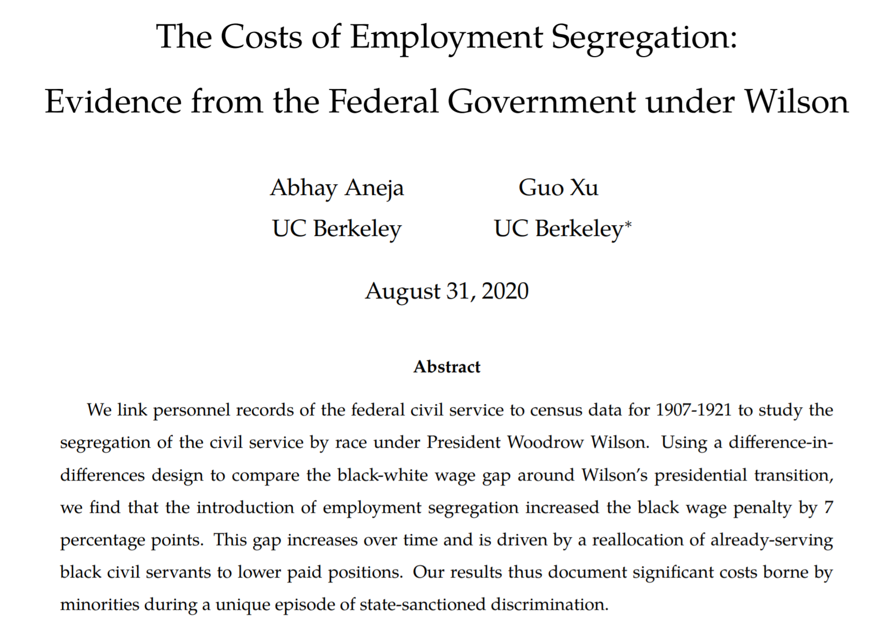
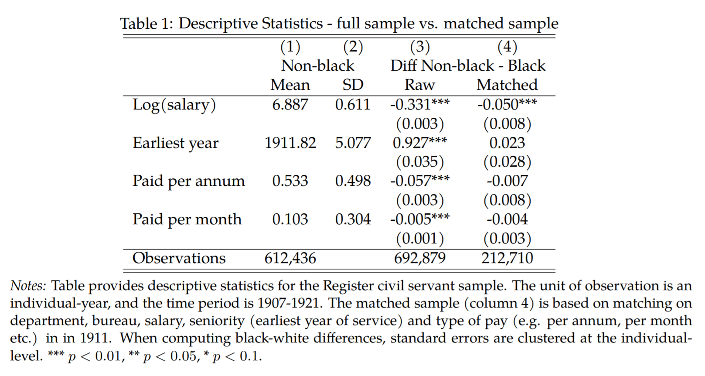
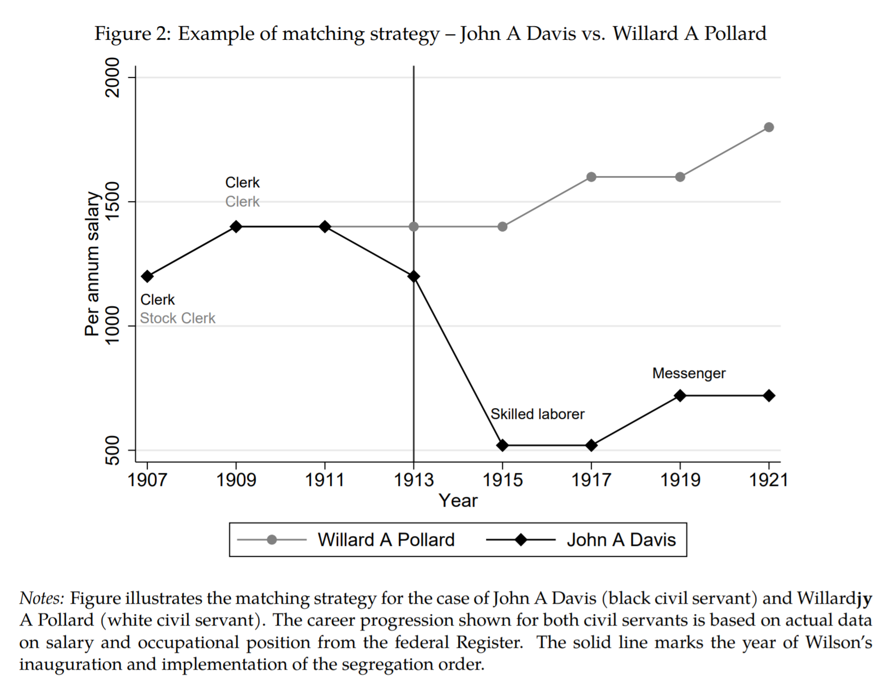

<link rel="stylesheet" type="text/css" href="http://tikzjax.com/v1/fonts.css">

**Agenda:**

- Intro to Controlling for Observables
- A survey of adjustment methods

# Recap: Measuring Causal Effects with Randomized Experiments

***
**Q:** Do randomized experiments solve the *fundamental problem of causal inference*?

***
**Why Randomized Experiments Work**

Randomized experiments are the "gold standard" for causal inference.

- When treatment is assigned independently of potential outcomes, we can estimate average counterfactual outcomes with the average observed outcomes of the appropriate group. This makes estimating average treatment effects very simple.

- In general, "treatment is assigned independently of potential outcomes" is an *assumption* we use to derive our estimator.

- However, deliberate randomization of treatment can make this a very safe assumption.

***

On the other hand...Could this study be run as a randomized experiment?

# Intro to Controlling for Observables

***
**Recap**

- Randomized treatment allows us to estimate causal effects by substituting observed outcomes in one group for the unobserved counterfactuals in another
- But, randomized experiments can be too costly or unethical to use in many real-world situations.

***
**Oberservational Studies**

- An *Observational Study* is a one where treatment is not assigned by the researcher, but is instead determined by some other process.
- When we try to measure causal effects in observational studies, we need to worry about *confounders*

***
**Review:** We call variable $X$ a ***confounder*** if it is an ancestor of both $D$ and $Y$.

Confounders can generate a statistical relationship between $D$ and $Y$ that is observationally equivalent to a direct effect $D \rightarrow Y$.

Example:

<!--beamer:\begin{center}-->

<!--beamer:\end{center}-->

***
**Real World Observational Data**

Let's look at a real-world case study.

**`NSWCaseStudy_blank.md`**

Step 1: Understand the data

- Where does the data come from?
- What do the variables mean?
- Compute the difference-in-means estimate of the ATT
- How does it compare to the experimental estimate?

*Work in small groups*

***
**`NSWCaseStudy_blank.md`**

Step 2: Data exploration

1. "Explore" the data
    - How are the variables distributed? Do you see any interesting patterns?
2. Look for evidence of confounders
    - *Hint: What confounders might exist in this setting? Can any of them be observed? What patterns would they be likely to create?*
3. **Prepare an interesting plot to show**
    - Make a plot that illustrates a potential confounder in the data
  
*Feel free to use AI tools to help you make plots, but make sure you understand what they show!*

***
**Controlling for Observables**

- The goal of "controlling for observables" is to to make the data look *as if* we had had run an experiment with randomized treatment, even when we did not.

- If successful, controlling for observables allows us to estimate average treatment effects with observational data.

- The challenge is that we cannot observe everything about each unit in the data. Instead we only have access to a limited number of descriptive variables, which we call ***covariates*** or ***observables***.

***
**"Controlling" vs "Adjusting"**

Controlling is another area of Causal Inference where people use different language to describe the same thing.

The following statements are all equivalent:

- *"We controlled for X,Y,Z"*
- *"Our control variables are X,Y, and Z"*
- *"We adjusted for X,Y and Z"*
- *"Our adjustment set is {X,Y,Z}"*

Which terminology you use is mostly a matter of taste.

***
**A simple example**

Suppose we have some data on a medical treatment where, on average:

- The outcomes are worse for older patients
- Older people are more likely to be treated than younger people

 

<!--beamer:\begin{center}-->

<!--beamer:\end{center}-->

Thus, age is a confounder because it is a causal ancestor of both treatment and outcome.

<!-- Thus, age is a confounder and our difference-in-means estimate will be biased (can you see which direction the confounding bias will go?). -->

***
**Estimating the ATT**

Suppose we want to estimate the average treatment effect on the treated (ATT) with the difference-in-means estimator:

The estimate will be:
$$\Delta Y = \overline Y_T(1) - \overline Y_U(0)$$

However, the true value of the ATT is:
$$ATT = E[Y_i(1)|D_i=1] - \color{cf} E[Y_i(0)|D_i=1]$$

***
The *bias* of the estimate is the difference between the expected value of the estimate and the true value:
$$
\begin{aligned}
Bias &= E[\Delta Y] - ATT \\
&= E[\overline Y_T(1) - \overline Y_{NT}(0)] - (E[Y_i(1)|D_i=1] - \color{cf} E[Y_i(0)|D_i=1] \color{black}) \\
&= E[Y_i(1)|D_i=1] - E[Y_i(0)|D_i=0]  \\
&\ \ \ \ \ - (E[Y_i(1)|D_i=1] - \color{cf} E[Y_i(0)|D_i=1] \color{black} ) \\
&= \color{cf} E[Y_i(0)|D_i=1] \color{black} - E[Y_i(0)|D_i=0]
\end{aligned}$$

**Implication:** The difference-in-means estimator will be biased if the observed outcomes for untreated units are not a good proxy for the counterfactual outcomes of treated units.

***
**Confounding Bias**

Confounders create correlations between treatment and outcome that are not due to a causal effect.

Another way to say this is that the potential outcomes in the treated and untreated groups are systematically different.

This means that the difference-in-means estimator will generally be biased when there are confounders.

 

***Note:*** In economics and some social sciences, this is often called "*selection bias*".

***
**Example: Age as a Confounder**

Let's go back to our medical treatment example with age as a confounder:

- Older patients are more likely to be treated and also have worse outcomes on average, regardless of treatment.
- So on average, the untreated outcomes for treated patients will be worse than the untreated outcomes for untreated patients:
$$\color{cf} E[Y_i(0)|D_i=1] \color{black} < E[Y_i(0)|D_i=0]$$
- This means that the bias will be negative and the difference-in-means estimator will *underestimate* the treatment effect.

***
**Constructing a better Counterfactual**

Suppose we focus on a specific treated unit, $i$, with age $x_i$ and we want to estimate its counterfactual outcome, $Y_i(0)$.

Some options:

1. Find a single control unit $j$ in the untreated group with the same age $(x_j=x_i)$ and use its outcome as an estimate of the counterfactual (Matching)
2. Use the average outcome of all control units with the same age $x_i$ as an estimate of the counterfactual (Post-stratification/Weighting)
3. Fit a statistical/machine learning model to predict the outcome for untreated units as a function of age, and then use the model to predict the counterfactual outcome for unit $i$ (G-computation/Regression)

***
**Prediction as Conditioning as Controlling**

When we use a confounding variable to help predict counterfactual outcomes, we are "controlling" for that variable.

More formally, what these procedures are doing is *conditioning* on the confounder when computing differences in expected outcomes.

Under the right conditions, this will give us an unbiased estimate of the true causal effect.

***
**Formal Requirements**

Mathematically, controlling for observables will give us an unbiased estimate of a causal effect if three assumptions hold:

1. Treatment is *conditionally independent* of the potential outcomes given $X$
2. $0 < P(D_i|X) < 1$ ("*Positivity*")
3. Stable Unit Treatment Value Assumption (SUTVA)

***
**Conditional Independence Assumption (CIA)**

The *Conditional Independence Assumption (CIA)* states that treatment is independent of the potential outcomes after conditioning on some set of observable covariates $X$.

In essence, CIA is a way of saying that treatment is effectively random after we control for certain observable covariates.

***
**Selection on Observables**

CIA will always hold if all confounders are *observable* (this is sometimes referred to as "*selection on observables*"). 

The problem is that we often need to control for *unobservable* variables.

Whether the CIA holds in practice will depend on the specific causal effect and available data.

***
**Comment:** *CIA is not testable from the data alone*. We will have to use our domain knowledge to judge whether it is reasonable in a particular context.

***
**Positivity**

The *Positivity* assumption states that for each value of $X$ there is some non-zero probability of observing both treated and untreated units:
$$0 < P(D_i|X) < 1$$

Basically, to predict counterfactual outcomes for a given treated unit, we need to observe some untreated units with the same (or at least similar) characteristics. Otherwise we are really just guessing.

***
**Common Support**

In practice, the positivity requirement often does not hold for *all* values of $X$ in our data. In these situations, we can still estimate causal effects for certain values of $X$ where positivity holds. 

The set of values for $X$ where we observe both treated and untreated units is called the *common support*.

***
When CIA, Positivity, and SUTVA hold with respect to covariates $X$, we can construct a similar argument to when treatment is fully independent of the potential outcomes:

If $D_i$ is independent of $Y_i(0)$ and $Y_i(1)$ conditional on $X$, then:

$$ \begin{aligned}
\color{cf} E[Y_i(0)|D_i=1,X_i=X] & \color{black} = E[Y_i(0)|D_i=0,X_i=X] \\
\color{cf} E[Y_i(1)|D_i=0,X_i=X] & \color{black} = E[Y_i(1)|D_i=1,X_i=X]
\end{aligned}$$

Which allows us to estimate the expected counterfactual outcomes from the observed outcomes by conditioning on $X$.

***
**Approaches to Controlling for Observables**

There are many of approaches to controlling for observables, including:

- Matching Estimators
- Weighting Estimators
- Regression
- Propensity Score Methods
- Causal Machine Learning
- Structural Models

These techniques are more similar than they sound: They can all be interpreted as ways of conditioning on control variables to create better predictions for counterfactual outcomes.

***
**Back to our NSW data**

**`NSWCaseStudy_blank.md`**

Goal:

- Use observable covariates to predict better counterfactuals and estimate the ATT

# A Survey of Adjustment Methods

***
**Five Big Ideas in Controlling for Observables**

1. Matching
2. Weighting
3. Imputation
4. Regression
5. Structural Modeling

***
**Matching**

Matching methods attempt to estimate counterfactual outcomes by finding similar units in the data that received a different treatment.

- **Exact Matching**: Find one or more units in the other treatment group with exactly the same covariate values.
- **Approximate Matching**: Find one or more units in the other treatment group with "similar" covariate values (there are many different algorithms with different definitions of "similar").

***
**Common Support**

The region of the covariate space where we can observe both treated and untreated units is called the ***common support***.

Matching estimators can only estimate treatment effects for units that lie in the common support.

***
**Selecting an Estimand**

Matching estimators can be used to estimate a variety of average treatment effects:

- To estimate the ATT, find one matched control for each treated unit
- To estimate the ATU, find one matched control for each untreated unit 
- To estimate the ATE, find one match from the other treatment group for every observed unit

***
**An example of causal inference with exact matching**

***
This table shows differences in the distribution of wages between black and other civil servants in the raw and matched data:

***

***
Look how the differences between the two groups are mostly eliminated by matching:

***
**Tradeoffs in Matching**

- Exact matching is often not feasible because only a tiny fraction of the data can be matched.
- Approximate matching allows us to find matches for a larger fraction of our sample observations.

...Unfortunately, as soon as we relax the constraint that observations need to be matched exactly, we also introduce the potential for our estimator to be *biased*. After all, we are only *approximately* conditioning on the matching variables.

***
**Bias-Variance Trade-off**

Matching estimators force us to make fundamental trade-off between *bias* and *variance*.

In general, choosing more restrictive matches leads to:

- Better matched controls within sample $\rightarrow$ reduced estimator bias
- Smaller sample $\rightarrow$ higher estimator variance, reduced external validity

***
**Internal/External Validity Trade-off**

Observations that can be matched are often systematically different than those that are hard to match. If the treatment effects are different between the two groups, using more restrictive matching will:

- Reduce bias when estimating the treatment effect for matched observations (better internal validity)
- Potentially *increase* bias if we apply the estimate to the unmatched observations (poorer external validity)

***
**Weighting Estimators**

Weighting estimators attempt to estimate counterfactual outcomes by re-weighting the observed outcomes of units in the other treatment group so that the weighted distribution of covariates matches the distribution of covariates in the treatment group of interest.

***
**Weighting Example**

Suppose we want to estimate the ATT in our example of age-based confounding. We can:

1. Estimate the mean observed outcome for treated units using and unweighted average:
$$\overline Y_T = \frac{1}{N_T} \sum_{i \in T} Y_i$$
2. Estimate the mean observed outcome for untreated units using a weighted average:
$$\overline Y_U^W = \frac{1}{\sum_{i \in U} w_i} \sum_{i \in U} w_i Y_i$$
where the weights $w_i$ are chosen so that the weighted distribution of age in the untreated group matches the distribution of age in the treated group.

***
**Weighting and the Common Support**

Note that weighting estimators can only estimate treatment effects for units that lie in the common support.

For example, if there are treated individuals who are 70 years old, but no control individuals who are 70 years old, there is no weight we can choose to make the control group have the same fraction of (weighted) individuals who are 70.

***
**Matching as Weighting**

Matching can be interpreted as kind of weighting estimator where:

- Each observation is weighted according to the number of times it appears in a matched pair
- Observations outside of the common support are given zero weight

***
**Choosing the weights**

We choose the weights to mimic the distribution of observed covariates in the population we want to estimate the treatment effect for:

- If we choose weights to match the distribution of covariates in the treated group, we can estimate the ATT
- If we choose weights to match the distribution of covariates in the untreated group, we can estimate the ATU
- If we choose weights to match the distribution of covariates in the overall population, we can estimate the ATE

***
**Imputation Methods**

Imputation methods attempt to estimate missing counterfactual outcomes using a statistical or machine learning model to predict outcomes as a function of covariates and treatment.

For example, to estimate the ATT we can:

1. Fit a model to predict untreated outcomes as a function of covariates and treatment
2. Use the model to predict the untreated outcome for each treated unit
3. Estimate the ATT by taking the average difference between observed and predicted outcomes for treated units

***
**Prediction as Controlling**

When we use a confounding variable to help predict counterfactual outcomes, we are "controlling" for that variable.

More formally, what these procedures are doing is *conditioning* on the confounder when computing differences in expected outcomes.

***
**Imputation and the Common Support**

Unlike matching and weighting, prediction methods do not require that the treated and untreated groups have common support in the covariates.

However, predictions outside of the common support are extrapolations (i.e. guesses) and will depend more on the modeling assumptions that the available data.

***
**Choosing an Estimand**

Imputation methods can be used to estimate a variety of average treatment effects:

- To estimate the ATT, predict counterfactuals for treated units only
- To estimate the ATU, predict counterfactuals for untreated units only
- To estimate the ATE, predict counterfactuals for all units

***
**Regression**

Statistical regression is one of the most common approaches to estimating causal effects. The basic idea is to fit a statistical model that predicts outcomes as a function of treatment and observed covariates, and then inspect the fitted model parameters to estimate treatment effects.

***
**Regression Complications**

Regression can be interpreted as a form of imputation that hides the steps of prediction and estimation inside a single procedure.

However, common regression approaches also imposes additional, non-obvious assumptions. Many people use regression without fully understanding the trade-offs they are making.

We will explore regression more deeply later in the course.

***
**Structural Modeling**

Structural modeling attempts to estimate causal effects by specifying a full model of the data generating process, including the relationships between all variables in the data.

Model parameters are estimated from the data, based on the assumption that the model is correctly specified.

Average treatment effects can then be estimated by using the model to predict counterfactual outcomes, or sometimes directly from the model parameters.

Structural modeling generally requires strong assumptions about the data generating process, but can be very powerful when the assumptions are valid.

***
**Summary**

- When treatment is not randomized, we need to worry about confounders
- We can use observed covariates to help us construct better counterfactuals and estimate causal effects
- Common approaches include matching, weighting, imputation, and structural modeling
- All approaches can be viewed as ways of conditioning on confounders to estimate better counterfactuals

***
**A fundamental limitation**

What if we can't observe all the confounding variables?

