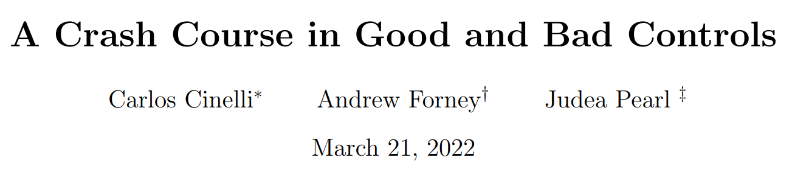

<link rel="stylesheet" type="text/css" href="http://tikzjax.com/v1/fonts.css">

**Agenda:**

- Good and Bad Controls
  - Selecting Control Variables with DAGs
  - Attrition Bias Revisited (in R)

# Good and Bad Controls

***
**Key Idea Behind Controlling for Observables:**

1) Confounders can create correlations in data that are indistinguishable from a causal effect and lead to biased causal estimates.
2) We can use techniques (such as matching, weighting, prediction, regression) to *control* for observable covariates.
3) Controlling for confounders prevents them from biasing our causal estimates.

***
**Two open questions:**

- What if we can't observe every confounder, but we have data on other related variables? Can we still estimate a causal effect?
- Should we condition on every observable covariate just in case they are confounders?

DAGs can be used to help us answer both of these questions.

***
**DAGs to the rescue**

This session we will explore how we can use DAGs to help us decide:

- Which variables we should control for
- Whether we can estimate a causal effect with a given set of observable covariates
- Which variables we should *not* control for

***
**Good and Bad Controls**

The simple 3-variable DAGs from the assignment show that controlling for a third variable can:

- Help us estimate a causal effect when the variable is a confounder
- Bias our estimate when the variable is a collider or mediator

But DAGs can also have more than three variables. How can we use them to select control variables in more complex models?

# Selecting Control Variables with DAGs

***
Recall that Directed Acyclic Graphs impose three restrictions on the causal model:

1. **Directed:** Causal relationships only go in one direction between nodes (no simultaneity)
2. **Acyclic:** No cycles/loops in the graph
3. **Conditional independence:** Pairs of variables without an arrow are *conditionally independent* given their causal connections.

***
**Conditional Independence in DAGs**

We can think of DAGs as a convenient notation for keeping track of Conditional Independence Assumptions (plus the direction of causal relationships):

- If there is no arrow between $X$ and $Y$ means that $X$ and $Y$ are independent conditional on the variables that connect them in the graph.
- It is often possible to condition on only a subset of the variables that connect $X$ and $Y$.
    - Judea Pearl's "Do-calculus" provides a complete algorithm for identifying sets of variables that achieve conditional independence.
    - We are going to focus on an important special case called the "*Backdoor Criterion*"

***
**A General Note of Caution:**

The mathematical logic that tells us how to use a DAG to select which variables to control for requires that the DAG is exactly correct.

We should always be skeptical of a DAG. 

- How sure are you that every important variable and arrow is included? 
- Are you confident that all the implied conditional independence assumptions are true?

***
**The Backdoor Criterion**

The Backdoor Criterion is a rule for identifying which variables we need to control for in order to estimate a causal effect. Essentially, it tells us how to block the effects of confounders.

The variables we will control for are called an *adjustment set*.

***
**Backdoor Paths**

The Backdoor Criterion is based on the idea of a *backdoor path*, which is any sequence of nodes that:

1. Connect the treatment $D$ to the outcome $Y$
2. Has an arrow into the treatment $D$ (only the arrow into the treatment needs to be in the correct direction).

Note that if $D \rightarrow Y$, this definition means that there must be a confounder on the backdoor path.

***
**Open and Closed Paths**

By default, we assume that the backdoor path is "open", meaning that the confounding relationship can be transmitted through the path to $D$ and $Y$ and bias our causal estimate.

However, paths can also be "closed" if:

1. We control for a variable on the path
2. The path contains a "collider"

Closed paths cannot bias our causal estimate.

***
**Colliders**

In the context of the backdoor criterion, a collider is a node on a path between $D$ and $Y$ that has two incoming arrows.

$$ A \rightarrow X \leftarrow B $$

Colliders flip the effect of conditioning:

- A backdoor path containing a collider is *closed* by default
- If we condition on a collider, we *open* the path

***
**Adjustment Sets**

Our goal with the backdoor criterion is to find an *adjustment set* of variables that we can control for in order to close all backdoor paths from $D$ to $Y$.

An adjustment set is any set of variables that meets two conditions:

A) No variable in the set is a descendant of $D$
B) Controlling for the variables in the set closes all backdoor paths from $D$ to $Y$.

***
**Applying the Backdoor Criterion**

We can use the Backdoor Criterion estimate a causal effect by following these steps:

1. Identify all backdoor paths from $D$ to $Y$.
2. Identify which backdoor paths are "*open*" and "*closed*".
3. Find an adjustment set that:
    a. Contains no descendants of D, and
    b. Closes all backdoor paths.
4. Estimate the causal effect while controlling for the variables in the adjustment set.

***
**Activity: Applying the Backdoor Criterion**

Download and open: `BackdoorDAGs.pptx`

***
**Re-cap:** If we have a DAG we trust, we can use the back-door criterion to determine what variables we need to condition on in order to interpret our estimate as a causal effect.

***
**Problem:** Confounding variables are often unobserved, and we can't control for variables we can't measure.

If all solutions to the Backdoor Criterion require controlling for an unobserved variable, it may be impossible to identify the causal effect.

<!--beamer:\begin{center}-->

<!--beamer:\end{center}-->

***
**Beyond the Backdoor Criterion**

Note the word *may* on the previous slide:

- The Backdoor Criterion does not give every possible solution to the problem of confounding. There may be additional solutions that can be derived with more advanced do-calculus.
- A natural experiment might provide an alternative estimation strategy that isn't obvious when you sit down to draw a DAG (a topic for a future session).

***
**Additional controls:**

What happens if we condition on *more* variables than required?

 
 
 

It depends!

***

*In general:*

- Controlling for variables that block backdoor paths is **good** (removes confounding bias)
- Controlling for descendants of D or Y is **bad** (introduces bias)
- Controlling for variables that affect Y but not D is **good but not necessary** (increases precision but doesn't affect bias)
- Controlling for variables that affect D but not Y is **bad** (can decrease precision or magnify confounding bias)

***
**Automated Control Variable Selection with DAGs**

For complex DAGs, it can be tedious to identify appropriate adjustment sets by hand. However, there are several tools which implement Pearl's Do-Calculus algorithm to  *automatically* identify adjustment sets.

Check out [https://www.dagitty.net/]() if you are interested to learn more about this.

***
**Other variable selection algorithms**

There are many other algorithms for selecting control variables that are not based on DAGs. For example,

- Stepwise regression
- LASSO

These usually have to do with improving model fit or predictive accuracy NOT causal inference. They often omit good controls or include bad controls.

***Do not blindly use these algorithms for causal inference!***

***
**Causal Inference and Machine Learning**

A related issue occurs when people throw all available data into a machine learning algorithm. 

The result can be an algorithm that is good at predicting observed outcomes, but bad at estimating causal effects.

***Bad controls are often good predictors!***

***
**Aside: Mediation Analysis**

Sometimes we are interested in mechanisms that explain the effect of $D$ on $Y$. This is called ***mediation analysis***. In this case we may want to estimate the causal effects of various mediators.

It's tempting to think we can accomplish this simply by controlling for the mediator in a regression model. However, this only works in the simplest situations.

In general, mediation analysis requires estimating *multiple* causal effects, each of which can have its own confounders.

# Attrition Bias

***
**Attrition Bias in Randomized Experiments**

Attrition bias is a common problem in randomized experiments.

- If units can drop out of a study before it is complete, the choice to drop out is often correlated with both the treatment and outcome. This usually means that the choice to drop out is a *collider* (a bad control).
- Then, when we study only the units that remain in the study, we are *conditioning* on that collider.
- This can lead to a biased estimate of the treatment effect, even if treatment was fully randomized.

***
**Attrition Bias as a DAG**

<!--beamer:\begin{center}-->

<!--beamer:\end{center}-->

**Q:** 

- What are the valid adjustment sets for estimating the causal effect of D on Y?
- What if you are *already* conditioning on $Remain$?

***
**Attrition Bias R Demo**

`AttritionDemo.Rmd`

Goal:

- See how attrition bias can arise in a randomized experiment
- Experiment with possible solutions

***
**Missing Data as Attrition**

In observational studies, we often have missing data - values in our dataset that are not recorded for some observations. In this case,

- Simply dropping observations with missing data could potentially lead to bias (just like attrition bias in experiments)
- Controlling for characteristics that affect missingness might help reduce bias, but cannot eliminate it entirely if some of the reasons for missingness are unobserved
- More advanced missing data techniques (e.g., multiple imputation) can also help reduce bias, but can also fail if some reasons for missingness are unobserved

