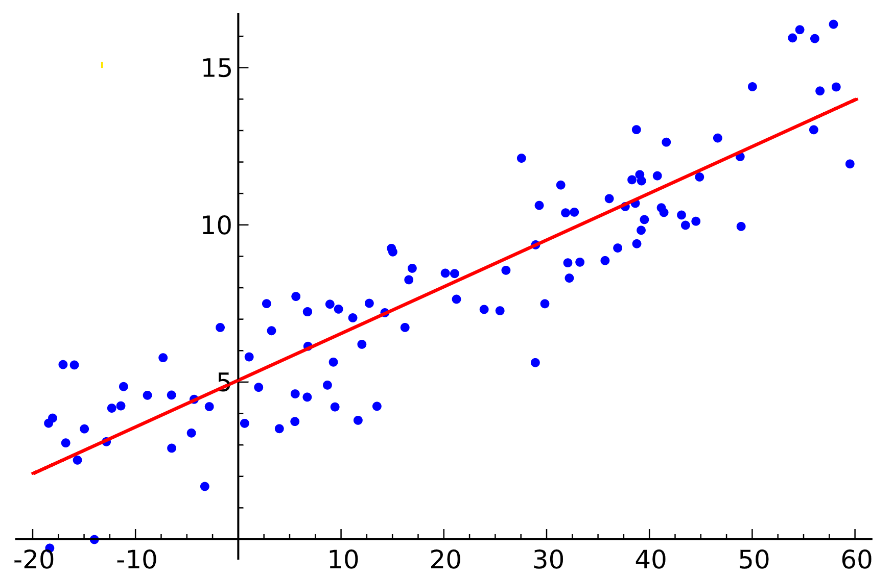

<link rel="stylesheet" type="text/css" href="http://tikzjax.com/v1/fonts.css">

**Agenda:**

- Intro to Regression
- Regression for Causal Inference
- The Table 2 Fallacy

# Intro to Regression

***
**Motivating Example: Estimating the Effect of Superhost Status**

 

 

**Research Question:** Does Superhost status increase revenue for Airbnb hosts?

***
**Data:** 6000+ listings in Toronto scraped by InsideAirbnb

***
**Practical Questions:**

- What do we need to control for?
- What data is available?
- Are there any variables in the data that we should *not* control for?
- What estimation method should we use?
- How do we interpret the results?

***
**Q:** Have you ever run a linear regression? How would you use a regression to estimate the effect of Superhost status on revenue?

***
**Regression Overview**

Regression is a flexible tool for analyzing data in which we summarize statistical relationships in a dataset by "fitting" a function to match the data as closely as possible, and then examine the properties of the fitted function.

***
**Regression Functions**

In general, we have $N$ observations $i=1,2,3,\dots,N$, and for each observation:

- A "***dependent variable***" denoted $Y_i$
- One or more "***independent variables***" denoted $X_{1i}, X_{2i}, X_{3i}, \dots$

The fitted regression function $\hat f$ produces a predicted value for the dependent variable $\hat Y_i$ as a function of the independent variables:

$$\hat Y_i = \hat f(X_{1i}, X_{2i}, X_{3i}, \dots)$$

***
**Regression Equations**

The function we are fitting to the data is often described by a ***regression equation***.

A regression equation describes how the independent variables are used to predict the dependent variable. It usually includes:

- ***Parameters*** that are selected when fitting the regression function
- ***Error terms*** that describe random variables that are:
  - Not observable in the data
  - Assumed to explain the difference between actual and predicted values.

***
**Example 1 (Simple linear regression)**:

$$ Y_i = \alpha + \beta X_i + \varepsilon_i $$

- $Y_i$ is the dependent variable
- $X_i$ is a single independent variable
- $\alpha$ and $\beta$ are regression parameters
- We call $\alpha$ the ***intercept term***
- $\varepsilon_i$ is an error term

***
**Example 2 (Multiple linear regression)**:

$$Y_i = \alpha + \beta_1 X_{1i} + \beta_2 X_{2i} + \beta_3 X_{3i} + \dots + \beta_k X_{ki} + \varepsilon_i$$

- $Y_i$ is the output of the function
- $X_{1i}, X_{2i}, X_{3i}, \dots, X_{ki}$ are the covariates
- $\alpha, \beta_1, \beta_2, \beta_3, \dots, \beta_k$ are regression parameters
- $\varepsilon_i$ is an error term

***
How do we "fit" the regression?

The most common approach is to use ***Ordinary Least Squares (OLS)*** .

***
**Ordinary Least Squares (OLS)**

Define the ***residual*** $e_i$ for each observation $i$ as the difference between the observed $Y_i$ and output of the regression equation:
$$
e_i = Y_i - \alpha - \beta_1 X_{1i} - \beta_2 X_{2i} - \beta_3 X_{3i} - \dots - \beta_k X_{ki}
$$
Then the OLS ***parameter estimates*** are the set of parameters that achieve the lowest *Sum of Squared Residuals (SSR)*:
$$ SSR = \sum_{i=1}^N  e_i^2 $$
We label the parameter estimates with "hats" to indicate they are specific estimated quantities: $\hat \alpha, \hat{\beta_1}, \hat{\beta_2}, \hat{\beta_3}, \dots \hat{\beta_k}$.

***
**Visualizing Simple Linear Regression**

***
**Linear Dependence**

The OLS estimator only has a unique solution if the independent variables are *linearly independent*.

**Definition:** Vectors $X_{0}, X_{1}, X_{2}, \dots, X_{k}$ are called ***linearly dependent*** or ***collinear*** if any variable $X_j$ can be expressed as a weighed sum of the other variables.

If you try to run a regression that contains any collinear variables, you will get an error.

***
**Example:** *BirthYear*, *Year*, and *Age* (as of December 31st), are collinear since:

$$ Age_i = Year_i - BirthYear_i $$

***
**Conditional Expectation Functions**

OLS estimates a linear approximation of a ***conditional expectation function***.

$$ E[Y_i| X_{1i}, X_{2i}, X_{3i}, \dots, X_{ki}] \approx  \hat \alpha + \hat \beta_1 X_{1i} + \hat \beta_2 X_{2i} + \hat \beta_3 X_{3i} + \dots + \hat \beta_k X_{ki}$$

It can be shown that (in the limit of infinite sample size), OLS provides the lowest mean square error out of any linear estimator.

***
**Nonlinearity**

The OLS prediction may not be very accurate if the true conditional expectation function is *nonlinear*. This is an important limitation of OLS.

However, many functions that appear to be nonlinear can be represented as a linear combination of appropriately transformed independent variables.

**Example:** The following regression estimates a conditional expectation function that is quadratic in $X_i$ but linear in $X_i^2$:

$$Y_i = \alpha + \beta_1 X_i + \beta_2 X_i^2 + \varepsilon_i$$

***
**Non-linear regression**

Regression does not need to be linear. There are many different approaches that allow the output of the regression to be a non-linear function of the inputs. Popular approaches include:

- **Non-parametric methods** that estimate smooth curves using local observations
- **Generalized Linear Models** feed the output of an "inner" linear function through a non-linear function to predict the output:
  - **Logistic regression** produces values in the range $(0,1)$. Often used to predict probabilities with binary data.
  - **Probit regression** is similar to logistic regression with non-linear function that is based on the normal distribution.
  - **Poisson Regression** produces predictions in the range $[0,\infty)$. Used to analyze count data, or other non-negative variables.

***
**Regression in R**

`RegressionInR.Rmd`

Goal:

- A quick tour of how to run regressions in R and interpret the output.

# Regression for Causal Inference

***
**The key question for causal inference is:** ***What does OLS estimate?***

...in a simple linear regression?
$$ Y_i = \alpha + \delta D_i + \varepsilon_i $$

...in a multiple linear regression with controls?
$$ Y_i = \alpha + \delta D_i + \beta X_i + \varepsilon_i $$

***
**R Demo**

Let's look at a simple example in R.

`RegressionForCI.Rmd`

Goal:

- Try a simple regression
- Try multiple regression with controls

What do they estimate?

***
**Linear Regression without Controls**

First, let's consider a simple linear regression:

$$ Y_i = \alpha + \delta D_i + \varepsilon_i $$

Recall that the fitted OLS parameters provide the *Best Linear Prediction* of the outcome conditional on treatment.
$$E[Y_i|D_i] \approx \hat \alpha + \hat \delta D_i$$

***
This linear prediction can be written separately for treated and untreated units to find the predicted potential outcomes:
$$\begin{aligned}
E[Y_i|D_i=1] & \approx \hat \alpha + \hat \delta \\
E[Y_i|D_i=0] & \approx \hat \alpha
\end{aligned}$$

Therefore,
$$\hat \delta \approx E[Y_i|D_i=1] - E[Y_i|D_i=0]$$

Look familiar?

***
In fact, in a simple linear regression of an outcome $Y_i$ on a binary treatment indicator $D_i$ like this:
$$ Y_i = \alpha + \delta D_i + \varepsilon_i $$

The parameter estimate $\hat \delta$ is mathematically equivalent to measuring the difference-in-means between the treated and untreated groups.

***
**Interpreting OLS Regression with Controls**

If we include an additional covariate $X$ in the regression:
$$ Y_i = \alpha + \delta D_i + \beta X_i + \varepsilon_i $$

Then $\hat \delta$ measures the average difference between two conditional estimates:
$$\begin{aligned}
E[Y_i|D_i=1] & \approx \hat \alpha + \hat \delta + \beta X_i \\
E[Y_i|D_i=0] & \approx \hat \alpha + \beta X_i
\end{aligned}$$

*However!* These two estimates assume that $\beta$ is the same for treated and untreated units. This may not be realistic!

***
**OLS and Heterogeneous Treatment Effects**

The common regression equation 
$$ Y_i = \alpha + \delta D_i + \beta X_i + \varepsilon_i $$
assumes that $\beta$ is constant across treatment groups.

This is equivalent to assuming that the average treatment effect is constant across units ($ATT=ATE=ATU$).

If $ATT \neq ATU$, then $\hat \delta$ will not estimate the ATT,ATU, or ATE (though it will be somewhere between the ATT and ATU).

***
**A more flexible specification**

One way to account for heterogeneous treatment effects is to modify our regression as follows:

1. Compute the mean $\overline X$ within our target group (e.g. the treated units for the ATT, or the whole sample for the ATE)
2. Replace $X$ with $\widetilde X_i = X - \overline X$ in our regression equation
3. Add an interaction term $D_i \widetilde X$ to allow for varying slopes in each treatment group.
$$ Y_i = \alpha + \delta D_i + \beta_1 \widetilde X_i + \beta_2 D_i \widetilde X_i + \varepsilon_i $$

***
**G-Computation**

Another alternative is to use G-computation to estimate the treatment effect.

1. Fit a model to that allows for different relationships between $X$ and $Y$ in each treatment group by including an *interaction* between $D$ and $X$.
2. Use the model to predict potential outcomes for all units
3. Estimate the ATE/ATT/ATU as the average difference between predicted $\hat{Y}(1)$ and $\hat{Y}(1)$ in the selected group.

***
**Another Problem: The Table 2 Fallacy**

People have a habit of interpreting the coefficients on control variables in a regression as if they were causal effects. This is a mistake!

Let's look at an example in R.

`Table2Fallacy.Rmd`

***
**The Linearity Assumption**

The key difference between OLS and the other estimators we have discussed is that OLS imposes the assumption that all the statistical relationships are linear.

- If true, OLS will perform better than any alternative estimator
- If there are important non-linear relationships, then OLS may be biased (we are only controlling for a *linear approximation* of the confounding variables)
- The linearity assumption is particularly important when we have units outside the common support. When we are *extrapolating* based on this linearity assumption.