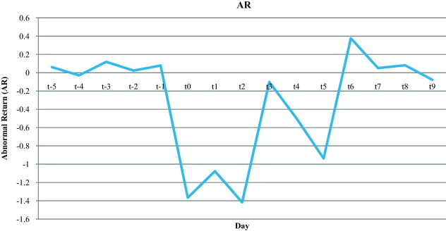

<link rel="stylesheet" type="text/css" href="http://tikzjax.com/v1/fonts.css">

**Agenda:**

- Fixed Effects
- Event Studies

# Causal Inference with Time Series and Panel Data

***
**Limits of Cross-Sectional Data**

So far in the course we have focused on *cross-sectional* data, where we have a single observation for each unit.

Causal inference with cross-sectional data (and no randomization) is *hard*. Unobserved confounders are everywhere, and we have to rely on strong assumptions to estimate causal effects.

***
**Time Series and Panel Data**

Time series and panel data provide us with additional information that we can use to help control for unobserved confounders.

- **Time Series** refers to data where we have multiple observations of a single unit over time.
- **Panel Data** refers to data where we have multiple units with multiple observations of each unit over time.

***
**Key idea:**

Time series and Panel data allow us to to compare outcomes for the same unit before and after treatment.

- If unobserved confounders are relatively stable over time, then we can control for them by using the pre-treatment outcomes to help us estimate better counterfactual outcomes (event studies).
- If we also observe both treated and untreated units over time, we can also use untreated units to help us estimate counterfactual outcomes for treated units in each time period (difference-in-differences).

# Fixed Effects

***
**Fixed Effects**

Fixed Effects (FE) estimators are a way to control for certain unobserved confounders that operate at the level of observable *groups*.

For example,

- Students within schools
- Employees within firms
- Individuals within geographic regions
- Observations within time periods
- Repeated observations of the same unit over time

***
In DAG form,

<!--beamer:\begin{center}-->

<!--beamer:\end{center}-->

 

In this model, each observation $i$ is also a member of group $g$. Each observation can have different treatment $D_{ig}$ and outcome $Y_{ig}$, but all units in the same group have the same value for the confounder $U_g$.

***
**Linearity Assumption**

Fixed Effects estimators are typically implemented using linear regression models. This means that they make an additional assumption $U_g$ has a linear (i.e., additive) relationship with  $Y_{ig}$.

$$Y_{ig} =  \alpha + \delta D_{ig} + \beta U_g + \varepsilon_{ig}$$

Where $\varepsilon_{ig}$ is an error term that is independent of both $D_{ig}$ and $U_g$.

***
**Fixed Effects Estimators**

With data on group membership we can estimate $\delta$ even in the presence of a linear unobserved group-level confounder $U_g$.

We can write fixed effects in a regression equation as a group-level intercept parameter $\alpha_g$

$$Y_i = \alpha_g + \delta D_{ig} + \varepsilon_{ig}$$

***
Under the hood, a FE estimator does one of two (equivalent) operations:

- Adds an *indicator variable* $M_{g}$ for every group $g$, where $M_{ig} = 0$ for every observation, except where $i$ is a member of $g$, in which case $M_{ig} = 1$, and regress
$$Y_i = \alpha_1 M_1 + \alpha_2 M_2 + \alpha_3 M_3 + \dots + \alpha_G M_G + \delta D_{ig} + \varepsilon_{ig}$$
- *De-mean* all variables in the regression by subtracting out each group mean for all observations in the group before running the regression.

*Note: Both operations are equivalent to controlling for the group ID as a factor variable*

***
**Intuition:** Each group-level intercept $\alpha_g$ will "absorb" any difference in the average outcomes between that group other groups. The effect of treatment will only be estimated based on *within-group* variation in treatment and outcomes.

$$\hat{\alpha}_g \approx \alpha + \beta U_g$$

**Result:** We don't need to control for a group-level confounder directly, as long as we can control for a set of variables that are *collinear* with the confounder (group membership).

***
**Note:** Groups that lack both treated and untreated units cannot be informative about $\delta$ (their group indicators are *collinear* with $D$). Most FE estimators will drop them automatically.

<!-- 
***
**Post-stratification and FE**

Fixed Effects regressions are very similar using post-stratification by group:

In both cases:

- We discard groups outside of the common support
- We estimate the effects "within" groups and then average over groups to get the final estimate

However, the weighting placed on observations will tend to be different (recall that OLS does not automatically estimate the ATE, ATT or ATU but instead estimates some other fourth thing). -->

***
**Multi-way Fixed Effects**

One thing that fixed effects estimators can do that is hard to do with post-stratification is to simultaneously include multiple levels of partially-overlapping fixed effects.

For example, one could include FE for

- *geographic region*, *industry category*, and *founding year*, or even
- *unit* and *year* when we observe the same units over time (this is known as the *2-way FE* estimator)

***
**Limits to Causal Inference with FE**

- ***Nonlinear Confounding relationships:*** If the confounders effects cannot be represented as an additive effect on outcomes, then the FE estimator will not fully "absorb" these confounding effects.
- ***Additional sources of bias:*** Controlling for fixed effects does not rule out the possibility that the there are additional confounders or that the "outcome" affects treatment rather than the other way around.
- ***Heterogeneous treatment effects:*** FE estimators can perform poorly when there are heterogeneous treatment effects (i.e., when the ATE, ATT and ATU are different).

***
**R Demo**

`FixedEffectsDemo_blank.Rmd`

Goals:

- Implement fixed effects regression with `fixest` package
- Compare FE estimates to controlling directly for confounders
- Explore multi-way fixed effects

# Event Studies

***
**Event Studies** 

I'll be using the term "*event study*" to refer to any analysis that estimates a causal effect by comparing outcomes before and after a particular event. 

This is a very broad definition, and includes many different types of analysis.

***
**Forecasting and Backcasting as Predicting Counterfactuals**

The key advantage of event studies is that we can observe the same unit (or units) before and after treatment.

This lets us make much more informed predictions about counterfactual outcomes by:

- Using the unit's own pre-treatment outcomes to predict post-treatment counterfactuals (*forecasting*)
- Using the units post-treatment outcomes to predict pre-treatment counterfactuals (*backcasting*)

***
**Forecasting and Backcasting as Controlling for Confounders**

Event studies can be seen as a special case of using prediction for causal inference. Using a variable to forcasting or backcasting outcomes is equivalent to controlling for that variable. 

This means:

- Event studies allow us to control for confounders that influence both past and future outcomes
- We need to be cautious not to use colliders or other bad controls in our forecasting or backcasting models

***
**Event Time**

When we have multiple units that are treated at different times, we can use the time relative to the event as a reference point for each unit. I'll refer to this as *event time*.

For example, if unit $i$ is treated in period $\tau_i$, we can define event time $t_i = t - \tau_i$ as the time since treatment for unit $i$.

Then we can estimate how outcomes change for each period of event time $t_i$.

***
**Event Study Plots**

The easiest way to visualize an event study is with an *event study plot*. These plots show the estimated effect in each period as a function of event time.

It is common to show estimates for both before and after the event, so that we can verify that the estimated effect is close to zero before the event.

***
**Example:** Abnormal returns to food-related company value after a food safety event (Seo et al. 2013)

***
**R Demo**

`AirlinesCovidEventStudy_exercise.Rmd`

Goals:

- Use `lm` to forecast counterfactual outcomes
- Use predicted counterfactuals to estimate causal effects
- Make an event study plot
