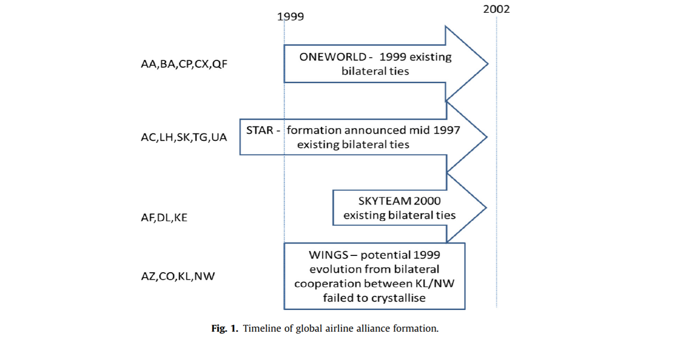
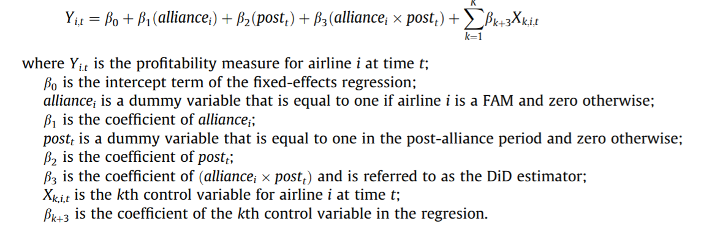
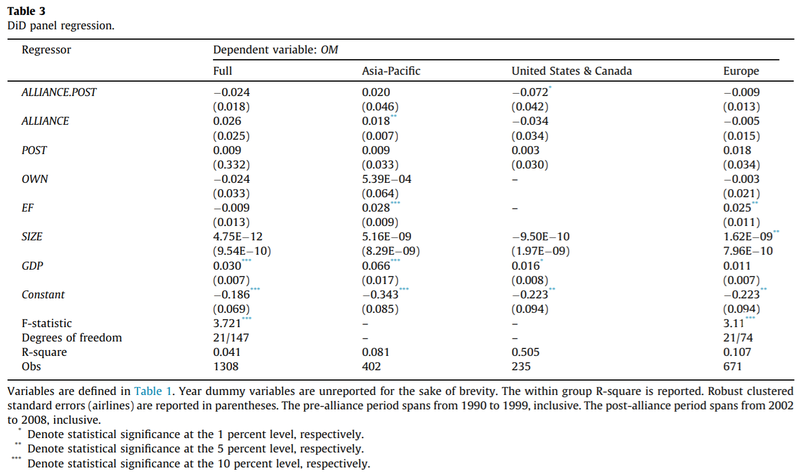
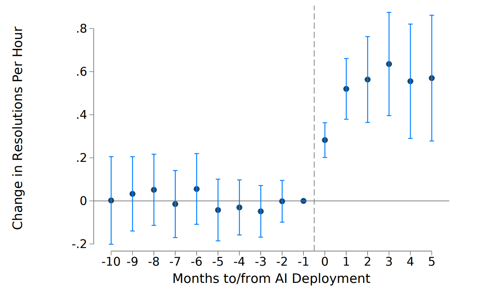
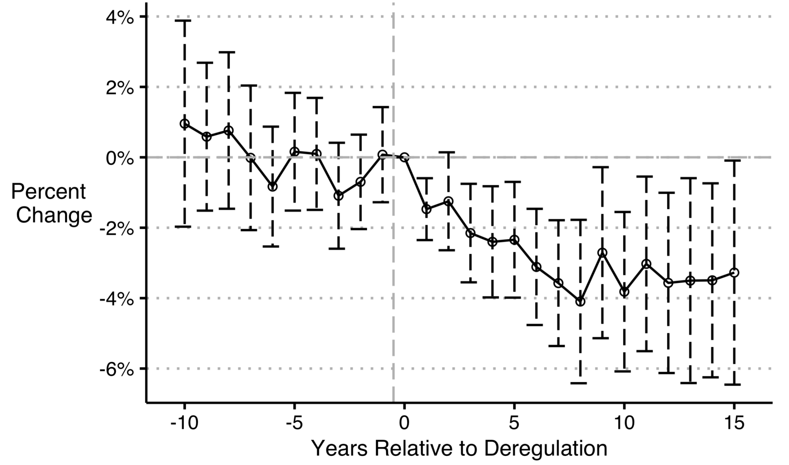

<link rel="stylesheet" type="text/css" href="http://tikzjax.com/v1/fonts.css">

**Agenda:**

- Difference-in-Differences designs
  - Two-period DiD
  - Dynamic Difference-in-Differences
- Netflix Password Sharing case study

# Intro to Difference-in-Differences

***
Difference-in-difference (DiD) designs use panel data to estimate a causal effect.

We can often find situations where:

- Units become treated at particular point in time (and we have data before and after the treatment event)
- Not all units are treated (and we have data on untreated units before and after the treatment event)

This allows us to use *within* and *across* unit comparisons simultaneously to estimate the causal effect of treatment.

***
Examples from industry:

- Estimating the effect of EBay keyword ads
- Airbnb estimating the effect of providing "verified" images on unit rental prices
- TD estimating the effect of employee training programs
- Netflix estimating the effect of providing language dubs on film views

***
DiD designs estimate causal effects by predicting a counterfactual based on both

- Each treated unit's pre-treatment outcome
- The observed outcomes for untreated units

The "difference-in-difference" terminology is meant to capture the idea that we can eliminate certain unobserved confounders by using

- The *difference* between outcomes before and after treatment for each unit
- The *difference in these differences* between treated and untreated units

***

 

<!--beamer:\begin{center}-->

<!--beamer:\end{center}-->

***
**Treatment notation**

I will use the following notation:

- The first period of treatment is $\tau$
- $D_i$ indicates if unit $i$ is *ever* treated
- $D_t$ indicates if $t \geq \tau$

Therefore, unit $i$ is treated in period $t$ if $D_{it} = D_i \times D_t = 1$

***
**Parallel Trends**

The key requirement for the DiD estimate to be unbiased is called the *parallel trends* assumption.

Parallel trends states that the average counterfactual outcome for treated units follows the same trend as the average observed outcome for untreated units.

We can write this in PO notation as:
$$E[Y_{it}(0) | D_{i}=1] = E[Y_{it}(0) | D_{i}=0] + c $$

***

 

<!--beamer:\begin{center}-->

<!--beamer:\end{center}-->

***
**Using the parallel trends assumption**

If the parallel trends assumption holds, then we can construct a consistent estimator of the ATT as follows:

First difference:
$$\begin{aligned}
\Delta Y_{Pre} := E[Y_{it}(0) | D_{i}=1, D_t = 0] - E[Y_{it}(0) | D_{i}=0, D_t=0] \\
\Delta Y_{Post} := E[Y_{it}(1) | D_{i}=1, D_t=1] - E[Y_{it}(0) | D_{i}=0, D_t=1] \\
\end{aligned}$$

Second Difference:
$$\delta = \Delta Y_{Post} - \Delta Y_{Pre}$$

***
Then, by parallel trends:
$$\begin{aligned}
\Delta Y_{Pre} &= c \\
\Delta Y_{Post} &= E[Y_{it}(1) | D_{i}=1, D_t=1] - E[Y_{it}(0) | D_{i}=0, D_t=1] \\
           &= E[Y_{it}(1) | D_{i}=1, D_t=1] - (E[Y_{it}(0) | D_{i}=1, D_t=1] + c) \\
\end{aligned}$$

And,
$$\delta = E[Y_{it}(1) | D_{i}=1, D_t=1] - E[Y_{it}(0) | D_{i}=1, D_t=1] = ATT$$

***

 

<!--beamer:\begin{center}-->

<!--beamer:\end{center}-->

***
**Something to think about:**

**Q:** If treatment is randomly assigned, would you expect the parallel trends assumption to hold?

***
**Parallel Trends and Randomization**

If treatment is randomly assigned, then the parallel trends assumption will always hold.

However, we often use DiD when treatment is *not* randomly assigned. In this case, parallel trends is an assumption about the dynamics of any unobserved confounders.

***
The parallel trends assumption will hold whenever the expected value of each unit's untreated potential outcome can be written as:
$$E[Y_{it}(0)] = U_i + U_t$$

Where $U_i$ and $U_t$ are (potentially unobserved) confounders that separately vary across units and over time.

<!--beamer:\begin{center}-->

<!--beamer:\end{center}-->

***
**Violations of Parallel Trends**

Another way to think about the parallel trends assumption is that it requires that there are no confounders that change over time for a subset of units.

Example violations of parallel trends:

- Treated units anticipate treatment and change their behavior before treatment
- Effects on treated units "spill over" to untreated units
- Treatment is selectively applied to units with different trends

***
**Estimation**

So how to we actually compute this difference-in-difference estimate?

There are two common approaches:

- OLS where regress $Y$ on $D_{it} = D_i \times D_t$, controlling for $D_i$ and $D_t$:

$$ Y_{it} \sim \alpha + \delta D_{it} + \beta_0 D_i + \beta_1 D_t +  \varepsilon_{it} $$

- With a two-way fixed effect estimator:

$$ Y_{it} \sim \alpha_i + \alpha_t + \delta D_{it} + \varepsilon_{it} $$

***
An example of a simple Difference-in-Difference research design:

***
**Abstract:**

*Alliances and partnerships between airlines are entered into to create competitive advantage, reduce costs, and expand network reach. ... This study examines whether the formation of global airline alliances, with its related expansion of network reach, resulted in an increase in profitability for the founding members. Employing difference-in-difference regressions, this study has found no evidence that the formation of global alliances improved the profitability of founding member airlines, or conferred an economic advantage over airlines that were not founding members. ... The results of this research suggest that regulators should be less anxious that by sanctioning these closer relationships they are providing major carriers with opportunities for excessive profits.*

***
**Airline Merger Timing**

***
Estimating the ATT:

**Q:** Which coefficient represents the DiD estimate of the ATT? What do the other coefficients tell us?

***

**Q:** What does the parallel trends assumption require in this context? Do you think it is likely to hold?

***

 

<!--beamer:\begin{center}-->

<!--beamer:\end{center}-->

# Dynamic difference-in-differences

***
**Dynamic Difference-in-Differences**

DiD only requires one period before treatment and one period after. But if you have several periods of data before and after, it is possible to conduct a *dynamic difference-in-difference* analysis by estimating the difference between treated and untreated units separately for each period.

The main advantage of a dynamic DiD design is that it allows you to visualize:

- The parallel trends assumption (before treatment only)
- Dynamic treatment effects (that change over time)

***
**DiD Event Study Plots**

As with the event studies we have discussed before, the estimates of time-specific treatment effects $\delta_t$ can be plotted as a function of time to visualize the estimated treatment effect over event time.

***
**Example DiD Event Study Plot**
 

***
**Estimating Dynamic DiD designs**

The basic intuition for dynamic DiD is that we can estimate a separate treatment effect for each period by comparing the outcome of treated and untreated units.

A common approach to estimating these period effects use OLS with a 2-way fixed-effects estimator:

$$ Y_{it} \sim \alpha_i + \alpha_t + \sum_{k=1}^{\tau-2} \delta_{k} 1_{\{t=k\}} D_{i} + \sum_{k=\tau}^{T} \delta_{k}  1_{\{t=k\}} D_{i}  + \varepsilon_{it} $$

***
**Reference Points**

Note that this complicated-looking dynamic DiD regression equation is actually very close to something much simpler:

$$ Y_{it} \sim \alpha_i + \alpha_t + \delta_t D_{i}  + \varepsilon_{it} $$

The problem is that we need to drop one of the $\delta_t$ parameters to avoid collinearity with the fixed effects. Convention is to drop the period prior to treatment $(t=\tau-1)$, which can be expressed with the previous formula.

The omitted factor becomes the reference point for defining the remaining $\delta_t$s.

***
**Interpreting DiD Event Study Estimates**

<!--beamer:\begin{flushleft}-->

<!--beamer:\end{flushleft}-->

***
**Interpreting DiD Event Study Estimates**

<!--beamer:\begin{flushleft}-->

<!--beamer:\end{flushleft}-->

***
**Parallel Trends and Event Studies**

If the parallel trends assumption holds, then:

1. Pre-treatment: Both treated and untreated units will follow the same trend ($\delta_t = 0$)
2. Post-treatment: The *counterfactual* outcome for treated units will follow the same trend as the untreated units, and the observed difference will be due entirely to the treatment effect $\delta_t$

Note that the second point is the one that actually matters for identification. It is also not directly observable or testable.

However, if we see different trends for treated and untreated units before treatment, it is a strong hint that parallel trends may also be violated after treatment.

***
**Q:** What does this plot suggest about the parallel trends assumption?

***
**Q:** What does this plot suggest about the parallel trends assumption?

***
**Technical Issue: Estimating Standard Errors**

It is very likely that the outcomes you are measuring are autocorrelated (each unit's outcome in one period is correlated with its previous outcome).

- By default, most statistical packages will not take this into account, and the estimated standard errors will be smaller than they should be (you will be given a false sense of accuracy).
- A simple and effective solution is to "cluster" your standard errors at the unit level. This means using a different algorithm for estimating the standard errors which allows for correlations within the cluster (in this case, the observations for a single unit).

***
**Staggered treatment**

A common variation in DiD designs involves *staggered treatment*. Instead of all treated units becoming treated at the same time, different units become treated at different times.

Staggered treatment can be helpful in estimating a causal effect because the analysis is less vulnerable to a simple change in trends around the time of treatment. However, it also introduces new challenges for estimation.

*Recent research has shown that 2-way FE estimators can be biased with staggered treatment if effects are heterogeneous over time.*

***
**Improved Estimators**

- **Callaway & Sant'Anna (2020)** Only allows comparisons between treated and untreated units (either because they never become treated, or because they have not yet been treated).
- **Sun and Abraham (2020)**: Use only never-treated units as controls.
- **Wooldridge (2021)** Adds additional interaction terms between fixed effects and treatment.
- **Borusyak, Jaravel, & Spiess (2022)** Use an *imputation* method where untreated outcomes are predicted using a 2-way fixed effects model that is fitted on untreated data only.

***

**Case Study: Netflix Password Sharing Roll-out**

On February 8th, 2023, Netflix announced that it would no longer allow subscribers to share account passwords with people outside of their household.

***
From Netflix's official Announcement:

 

> We’ve always made it easy for people who live together to share their Netflix account with features like profiles and multiple streams. While these have been hugely popular, they’ve also created confusion about when and how you can share Netflix. Today, over 100 million households are sharing accounts — impacting our ability to invest in great new TV and films."

 

> So over the last year, we’ve been exploring different approaches to address this issue in Latin America, and we’re now ready to roll them out more broadly in the coming months, starting today in Canada, New Zealand, Portugal and Spain. 

***
**Q:** Why do you think Netflix chose to roll out this change in these countries first? Why Canada in particular?

***
From Netflix's Q1 Shareholder letter:

 

> Paid sharing is another important initiative as widespread account sharing (100M+ households) undermines our ability to invest in and improve Netflix for our paying members, as well as build our business. We’re pleased with the results of our Q1 launches in Canada, New Zealand, Spain and Portugal, strengthening our confidence that we have the right approach....

***

> ...As with Latin America, we see a cancel reaction in each market when we announce the news, which impacts near term member growth. But as borrowers start to activate their own accounts and existing members add “extra member” accounts, we see increased acquisition and revenue. **For example, in Canada, which we believe is a reliable predictor for the US,** our paid membership base is now larger than prior to the launch of paid sharing and revenue growth has accelerated and is now growing faster than in the US.

***

**R Demo: Netflix Password Sharing Roll-out**

- Simulate some simplified subscriber data
- Estimate DiD with `lm`
- Estimate dynamic DiD and show event plot with `feols` from the `fixest` package
- Explore what happens if the parallel trends assumption is violated

