<link rel="stylesheet" type="text/css" href="http://tikzjax.com/v1/fonts.css">

**Agenda:**

- Natural Experiments
  - Instrumental Variables
  - Regression Discontinuity Designs

# Natural Experiments

***
So far we have focused on how to control for confounders by *conditioning on observable variables*. This is a powerful approach, but in most circumstances it is hard to be confident that there are no unobserved confounders.

<!--beamer:\begin{center}-->

<!--beamer:\end{center}-->

***
We use the term ***"Natural Experiment"*** to refer to a situation where events that are out of the researchers control nevertheless lead to conditions that resemble randomized treatment for some specific population.

<!--beamer:\begin{center}-->

<!--beamer:\end{center}-->

***
**An example of a natural experiment:**

***
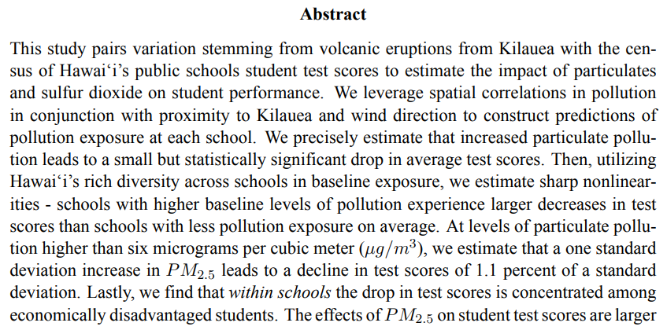

***
**Another example of a "natural" experiment:**
\centering
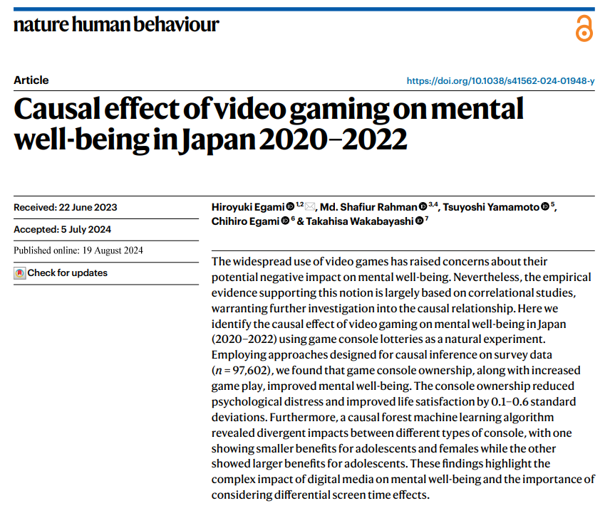

***
**From the Abstract:**

*"We identify the causal effect of video gaming on mental well-being in Japan (2020-2022) using game console lotteries as a natural experiment... we found that game console ownership, along with increased game play, improved mental well-being. The console ownership reduced psychological distress and improved life satisfaction by 0.1–0.6 standard deviations."*

***
**The "Experiment"**

*"Supply chain disruptions and surged demands during [Covid] limited the availability of two major gaming consoles: Nintendo Switch (Switch) and PlayStation 5 (PS5). To address these shortages, Japanese retailers used lotteries to assign these gaming consoles to consumers, inadvertently creating a plausibly random distribution of opportunities to play video games. Winning a lottery became the primary determinant of whether one could purchase these consoles."*

***
**The Results**

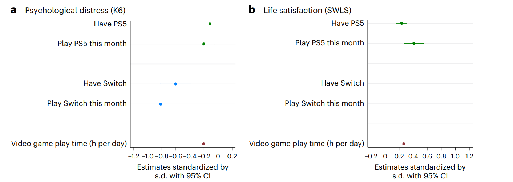

***
**Yet another example:**

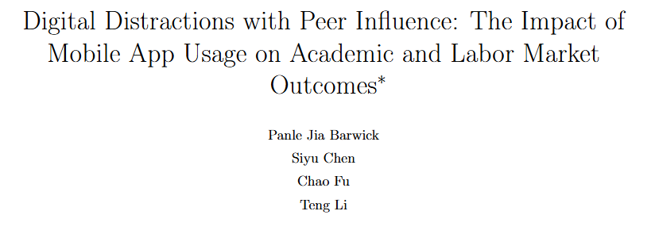

***
**From the Abstract:**

*"Our analysis leverages administrative data from a Chinese university of three cohorts of students over up to four years merged with mobile phone records, random roommate assignments, and a policy shock that affects peers’ peers. App usage is contagious: a one s.d. increase in roommates’ in-college app usage raises own app usage by 5.8% on average, with substantial heterogeneity across students. High app usage is detrimental to all outcomes we measure."*

***

*"A one s.d. increase in app usage reduces GPAs by 36.2% of a within-cohort-major s.d. and lowers wages by 2.3%. Roommates’ app usage exerts both direct effects (e.g., noise and disruptions) and indirect effects (via behavioral spillovers) on GPAs and wages, resulting in a total negative impact of over half the size of the own usage effect. Extending China’s minors’ game restriction of three hours per week to college students would boost their initial wages by 0.9%."*

***
**The "Experiment"**

*"We use two sets of instruments. The first exploits the 2019 China’s minors’ game restriction ... which directly impacted 8% of our sample students but indirectly affected all of them through their underage friends. ... The second set of instruments exploits the launch of the blockbuster game “Yuanshen” midway through our sample period. We interact Yuanshen’s release date with students’ pre-college app usage to construct a shift-share type of instruments, while controlling for student fixed effects and other time-varying confounding factors whenever possible."*

***
In the extreme case, a natural experiment may randomize treatment so thoroughly and convincingly that treatment can be assumed to be independent of the outcome and the difference-in-means will be sufficient for a convincing causal estimate.

More commonly, the randomization will be imperfect in some way: Maybe it only applies to a subset of the population, or doesn't completely determine treatment. In these cases we need to use statistical estimators to isolate the random variation in treatment.

# Instrumental Variables Estimators

***

***Instrumental Variables (IVs)*** are variables that provide information about random variation in treatment, allowing one to estimate causal effects even in the presence of unobserved confounders.

A variable must satisfy two conditions to work as an IV:

1. The variable is correlated with treatment (*relevance*)
2. The variable is independent of the outcome, conditional on treatment (*exclusion restriction*)

***
**A simple IV**

The simplest case of an IV is when we have a variable $Z$ that affects treatment (*relevance* $\color{orange} \checkmark$) but has no effect on the outcome except *through* treatment (*exclusion restriction* $\color{orange} \checkmark$).

<!--beamer:\begin{center}-->

<!--beamer:\end{center}-->

Then $Z$ creates differences in treatment that are much like a randomized experiment.

***
**Exclusion Restriction**

If the variable we want to use as an IV is linked to the outcome through some alternative path that does not go through treatment, then we will not be able to separate the causal effect from other correlations between treatment and outcome.

<!--beamer:\begin{center}-->

<!--beamer:\end{center}-->

This could be the result of either an effect of $Z$ on $Y$, or a confounding variable that affects both $Z$ and $Y$.

***
**The exclusion restriction is not directly testable!**

It is not possible to fully distinguish between a violation of the exclusion restriction and the presence of an unobserved confounder.

<!--beamer:\begin{center}-->

<!--beamer:\end{center}-->

The only way to be confident that an IV satisfies the exclusion restriction is *domain knowledge*.

***
**Conditional IVs**

It is also possible to use IV methods when there is a violation of the exclusion restriction that can be blocked by conditioning on an observed variable:

<!--beamer:\begin{center}-->

<!--beamer:\end{center}-->

***
**Multiple IVs**

It is also possible to use multiple instruments simultaneously (if you happen to be so lucky as to find them).

<!--beamer:\begin{center}-->

<!--beamer:\end{center}-->

However, more instruments are not always better. Each instrument may provide additional information about treatment, but it also introduces additional noise into the first stage.

This is particularly a problem for *weak instruments*.

***
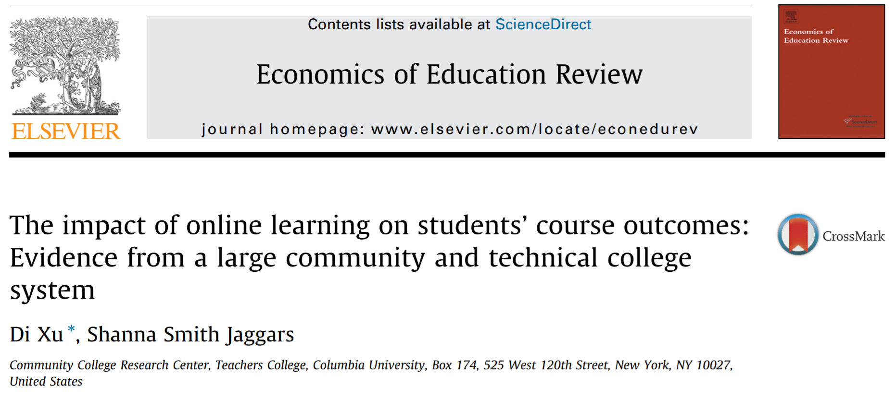

***
**Q:**

- What is the causal effect being estimated? (treatment, outcome, potential outcomes)
- What is the potential confounding problem?
- What is the instrument employed by the researches? What effect is it assumed to have on treatment?

***
"*In this analysis,* ***we used the distance from each student’s home to their college campus as an instrument for the student’s likelihood of enrolling in an online rather than face-to-face section.*** *Specifically, we first identified the associated geocode for each address in the dataset, including both student home address and college address; we then used Google Maps to calculate the ‘‘travel distance’’ between each student’s home and their college of attendance. Given that online courses offer the flexibility of off-site education,* ***students who live farther from their own college campus might be more likely to take advantage of online courses, compared with students who live closer to their college.*** "

***
**Q:** What does the exclusion restriction require in this setting? Do you find it believable?

***

<!--beamer:\begin{center}-->

<!--beamer:\end{center}-->

# IV Estimation

***
There are two common approaches to estimating causal effects with IVs.

1. Two Stage Least Squares (2SLS)
2. Control Functions

***
Both approaches essentially attempt to decompose $D$ into to two parts:

- $D_Z$: Changes in treatment driven exclusively by the instrument(s)
- $D_U$: The remaining variation in treatment, including changes in treatment caused by unobserved confounders.

Where $D = D_Z + D_U$

This decomposition is called the *first stage*.

***
Graphically, we can visualize this decomposition with the following modified DAG:

<!--beamer:\begin{center}-->

<!--beamer:\end{center}-->

 

**Q:** What do we need to control for if we want to estimate the effect of $D$ on $Y$? What about the effect of $D_Z$ on $Y$?

***
The modified DAG suggests two strategies for estimating the causal effect with the new variables (the *second stage*):

1. Regress $Y$ on $D_Z$ $\rightarrow$ *2SLS*
2. Regress $Y$ on $D$, controlling for $D_U$ $\rightarrow$ *Control Function approach*

***
**A minimal example (one IV, no controls, linear effects)**

<!--beamer:\begin{center}-->

<!--beamer:\end{center}-->

Suppose the data is generated by the following structural model:
$$ \begin{aligned}
Y_i =\delta D_i + U_i \\
D_i = \pi Z_i + U_i
\end{aligned} $$

***
**Two Stage Least Squares Approach**

First stage:

- Regress $D \sim \pi Z + \varepsilon$
- Get predicted treatment $D_Z = \hat \pi Z$

Second Stage:

- Regress $Y \sim \delta D_Z + \varepsilon$

***
**Control Function Approach**

First stage:

- Regress $D \sim \pi Z + \varepsilon$
- Get residual $D_U = D - \hat \pi Z$

Second Stage:

- Regress $Y \sim \delta D +  \gamma D_U + \varepsilon$

***
**R Demo: `NaturalExperiments_blank.Rmd`**

 

**Goals:**

- Use an IV to estimate a causal effect
- Illustrate IV conditions (Relevance and exclusion restriction)

***
Tradeoffs:

- 2SLS is most common approach for linear models. Many full-featured estimation packages exist.
- Control Functions are more flexible (e.g. can be used with non-linear first stages), but might need to be hand-coded.

***
**Q:** How did Xu & Jaggers implement their IV estimator to estimate the impact of online learning?

***

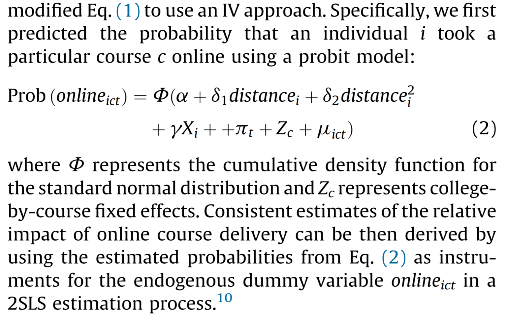

***
A third recipe for dealing with non-linear first stage:

1. Estimate probability of treatment using a non-linear regression
2. Predict probability of treatment using fitted regression
3. Use predicted probabilities as instrument in 2SLS

This is another way to deal with a non-linear first stage.

(Note: it is *not* valid to use the coefficients from the non-linear regression directly as a first stage for 2SLS)

***

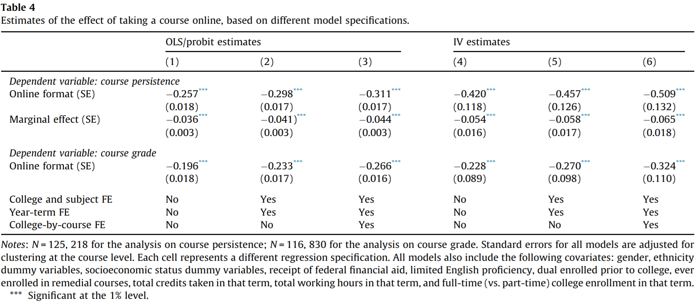

# IV Challenges

***

IV estimators can be difficult to use in practice. There are at least three main challenges:

1. Finding a valid instrument
2. Interpreting the estimated coefficient
3. Estimating standard errors and confidence intervals

***
**Challenge 1: Finding an Instrument**

Finding an IV requires convincing yourself and others that the exclusion restriction is not violated. The only way to do this is to try to imagine plausible violations. If you can't think of any, then the IV *may* be valid.

This is a lot like convincing yourself that there are no unobserved confounders.

But how can we ever be completely confident that something unobserved does not exist?

***
**The story of IV Designs in economics**

Twenty years ago, IV designs were very popular. Economists were using IVs to measure the causes of long-run growth, wages, labour-force participation, returns to schooling, conflict, political outcomes, and much more.

For example, are at least 192 studies that use rainfall as an instrument for some social or economic outcome (Mellon, 2022).

***
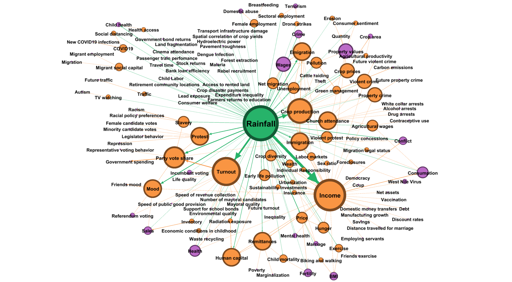

**Q:** Is it possible to use the same IV for multiple studies with different treatment and outcome variables?

***
Many older studies failed to make a convincing case that their IVs satisfy the exclusion restriction, or they suffered from weak instruments. There has been a bit of a backlash, and IV methods are currently not very popular among economists (we are as prone to fads as anyone else).

Researchers are now much more skeptical when evaluating an IV research design.

***
**Are IV Designs ever useful?**

Yes. IVs can still be very convincing if it is clear that the instrument is *randomly assigned*. This could occur either because of:

1. Deliberate randomization
2. A particularly clear natural experiment

***
**Intent to treat designs**

Sometimes we can randomize treatment assignment, but cannot enforce compliance. In these settings, units are randomly exposed to conditions that allow or encourage treatment, but not everyone who is eligible receives treatment.

For example:

- Draft lotteries
- Clinical trials where people need to take daily doses at home

IV methods (often 2SLS) can be used to estimate the effect of treatment on the eligible population.

***
**Challenge 2: Interpreting the IV coefficient**

When IVs have different effects on different individuals, then we can actually only measure a *Local Average Treatment Effect (LATE)* .

The LATE for an IV is the *average treatment effect among units that change their treatment status in response to treatment*. This group may have different characteristics than the rest of the population.

We also want to watch out for IVs that have *opposing* effect on the treatment of different units - this can bias our causal estimate.

***
**Challenge 3: Estimating Standard Errors**

Many software packages compute standard errors that are asymptotically correct for 2SLS.

However, there is an additional challenge when the instrument is *weak*.

***
**Weak Instruments**

A *weak instrument* is a variable that satisfies the exclusion restriction, but is only weakly correlated with treatment.

<!--beamer:\begin{center}-->

<!--beamer:\end{center}-->

Weak instruments introduce a lot of noise relative to the additional information about treatment, and can decrease the precision of causal estimates.

There are special estimation techniques intended to make the best of this situation, but it is always challenge for inference.

***
**Reduced Form**

If we estimate the total effect of $Z$ on $Y$, we call this the "*reduced form*" (in our simple example, we would regress $Y \sim \beta Z + \varepsilon$).

It is possible to show that:
$$\hat \delta_{IV} = \frac{\hat \beta}{\hat \pi}$$

 

Implications:

1. Estimates can "explode" in scale if $\hat \pi$ is close to zero
2. $\hat \beta \approx 0$ indicates at least one of $\hat \delta_{IV} \approx 0$ or $\hat \pi \approx 0$.

***
**Summary:**

- Natural experiments can provide random variation in treatment that can be used to estimate causal effects.
- Instrumental Variables (IVs) are variables that can isolate random variation in treatment.
- Two common IV estimation approaches are Two Stage Least Squares (2SLS) and Control Functions.
- IV designs can be challenging to use in practice: We need to find valid instruments, interpret Local Average Treatment Effects, and deal with estimating standard errors.

# Regression Discontinuity Designs

***
**Regression Discontinuity Designs (RDD)**

RDD estimators are a special case of IV where we have a continuous "running variable" with a sharp cutoff where the probability of treatment changes discontinuously.

***
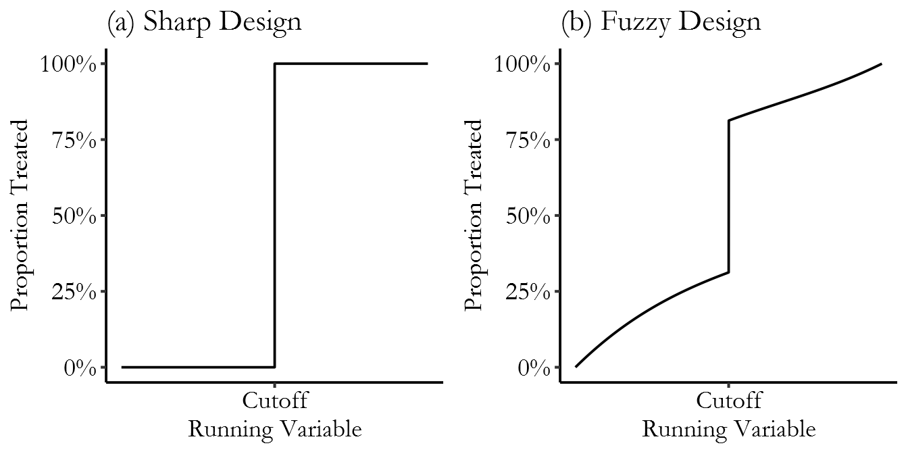

***
An illustration of a sharp RDD:

\centering

***
**RDD Intuition**

Even if the running variable is has a direct effect on the outcome, if the direct effect is "smooth", then the change in outcome *right* at the cutoff will still be driven entirely by the change in treatment.

***

Formally, we require that the conditional expectation of both potential outcomes are continuous (smooth) at the cutoff.

<!--beamer:\begin{center}-->

<!--beamer:\end{center}-->

***

We can estimate the *Local Average Treatment Effect (LATE)* at the cutoff by discarding all the data outside of a narrow "bandwidth".

***
From *The Effect*, Chapter 20:

***

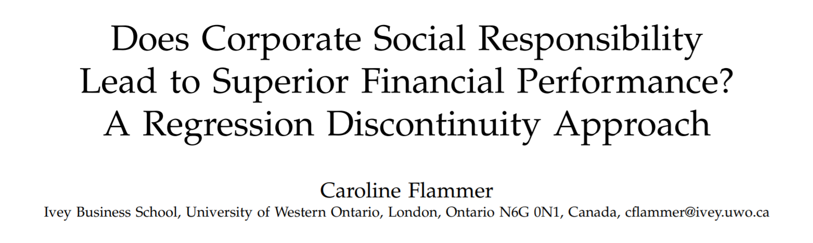

**Q:**

- What is the research question and setting?
- What causal effect is the author estimating? Treatment? Outcome? Potential Outcomes?
- How does the author employ RDD? What is the running variable and source of the discontinuity in treatment?

***

**Q:** What is this plot showing? Can you see the estimated effect?

***
**The Exclusion Restriction in RDD**

Recall that the exclusion restriction requires that the IV is independent of the outcome conditional on treatment.

In RDD, we only need to worry about violations near the discontinuity (within the bandwidth). However, there are still some ways that the exclusion restriction can be violated:

- If units sort themselves to one side of the cutoff based on their expected outcome
- If there is a confounding relationship that also has a discontinuity at the same point
- If the confounding relationship is continuous, but so non-linear that it is not constant within the bandwidth

***
Here is some data on marginal tax rates and the distribution of reported income in Denmark in 2009 (Maire & Schjerning, 2013):

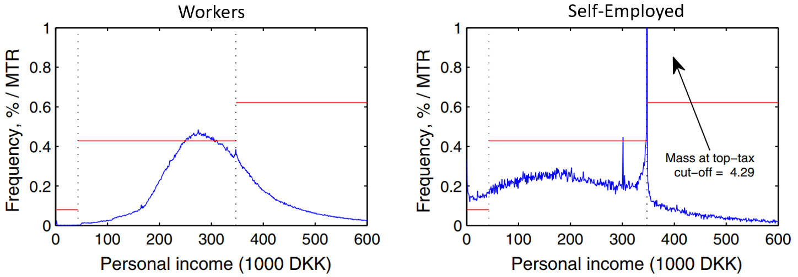

**Q:** Can you see any issues with using an RDD to estimate the effect of marginal tax rates on some other outcome (e.g. the choice to become self-employed)?

***
**Bunching Estimators**

When we observe units sorting themselves to one side of the cutoff, we can sometimes use this to estimate how much effort they are willing to exert to avoid the treatment. This can help estimate the causal effect of the treatment on the income or wellbeing of the units themselves.

***
**Back to the Exclusion Restriction in RDD:**

Recall that the exclusion restriction requires that the IV is independent of the outcome conditional on treatment.

In RDD, we only need to worry about violations near the discontinuity (within the bandwidth). However, there are still some ways that the exclusion restriction can be violated:

- If units sort themselves to one side of the cutoff based on their expected outcome
- If there is a confounding relationship that also has a discontinuity at the same point
- If the confounding relationship is continuous, but so non-linear that it is not constant within the bandwidth

**Q:** Does it seem possible that any of these scenarios might apply in Flammer's study?

***
McCrary density test from Flammer (2015):
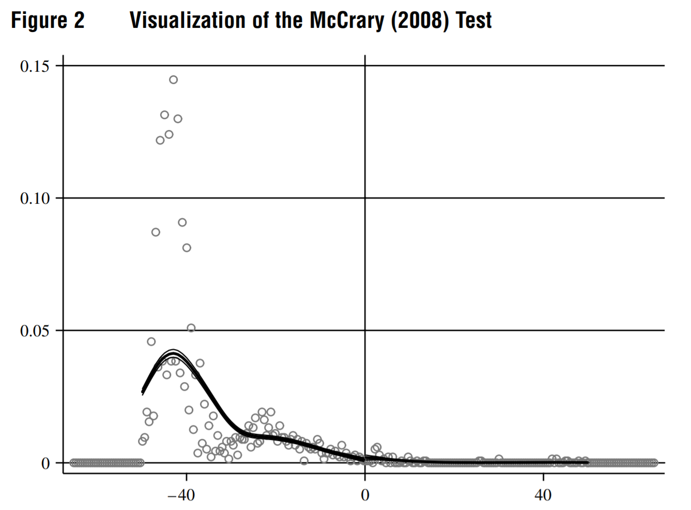

***
Part of what makes RDD convincing is that we can use the data check for many potential problems:

- Visually, with an *RD Plot*
- Statistically, with *Specification Tests*

***
**RDD Plots**

People expect to see a good RDD plot, and will often evaluate the quality of the estimate based more on this plot than any formal statistical test.

An RDD plot has:

- The running variable as the x-axis and the outcome as the y-axis
- The discontinuity clearly labelled
- Some clear presentation of the raw data, usually local means for binned observations.
- Estimated mean outcomes on either side of the discontinuity

***
**Specification Tests:** (adapted from Imbens & Lemieux, 2007)

- Check for discontinuities in covariates
  - Conditional expectation of pre-treatment covariates should be continuous
- Check for discontinuity in observation density at threshold (McCrary test)
  - Not explicitly required for identification, but could indicate sorting
- Check for apparent discontinuities in outcome at other locations along the running variable ("placebo tests")
  - Tests estimator performance on your real data
- Run estimator with multiple bandwidths and different covariates
  - Estimates should not be too sensitive to these changes

***
**R Demo: `NaturalExperiments_blank.Rmd`**

 

**Goals:**

- Use an IV to estimate a causal effect
- Illustrate IV conditions (Relevance and exclusion restriction)
- Show how RDD estimators can work even when standard IV fails

