<link rel="stylesheet" type="text/css" href="http://tikzjax.com/v1/fonts.css">

**Agenda:**

- Synthetic Control
- Causal Inference with Machine Learning
  - Double Machine Learning
  - Conditional Average Treatment Effects
  - Causal inference with AI?

***
**Nonlinear DD**

Suppose you want to predict the ATT in a standard DD setting, but you are worried that the parallel trends assumption might not hold.

 

**Q:** Is there anything you can do?

***
**Synthetic Control**

Synthetic control constructs a counterfactual untreated trajectory for a single treated unit as a *convex combination* of control units.

- Convex combination = weighted average with no negative weights
- Weights on control units are selected to maximize the predictive accuracy in the pre-treatment period

*Instead of hoping the parallel trends assumption holds, let's try to make it hold!*

***
Example:  Estimating the effect of German re-unification on Per-Capita GDP in West Germany
(Abadie, Diamond, and Hainmueller, 2015)

***

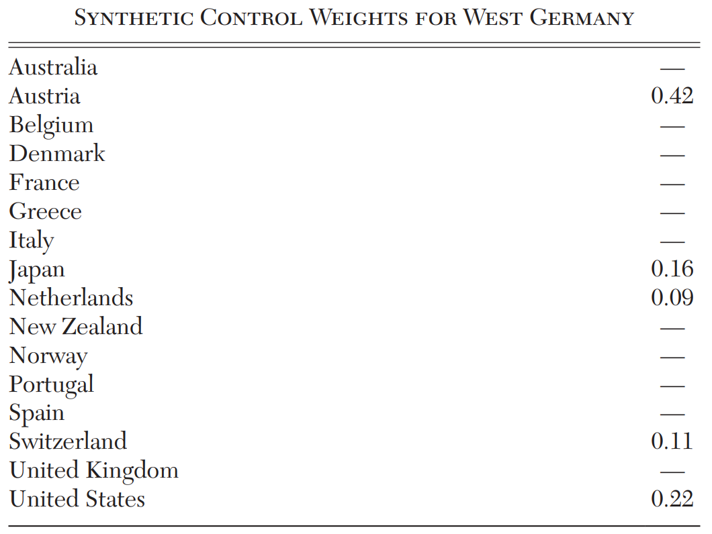

***
**Advantages of Synthetic Controls:**

- Robust to many violations of the parallel trends assumption
- Weights on control units can be examined in a transparent way

***
**Related Methods**

In fact, synthetic control is just one of many related methods for estimating counterfactual time series. In general, we can use any flexible prediction method to estimate counterfactual outcomes over time.

The key challenge is that more complex algorithms are often biased in complex ways (even if they have smaller errors overall), so we need to be careful about how the algorithms are used and how we conduct statistical inference.

# Causal Inference with Machine Learning

***
**Q:** What is "Machine Learning"? What algorithms have you encountered? What problems have you seen it used to solve?

***
**Defining properties of ML:**

- Universal function approximation
- High-dimensional data (i.e. many variables per observation)
- Prediction rather than inference
- Regularization to prevent over-fitting
- Out-of-sample testing

***
**Prediction for Causal Inference**

Recall that we can estimate causal effects by:

1. Predicting outcomes as a function of treatment and covariates (regression, G-computation)
2. Predicting treatment as a function of covariates (propensity scores)

In theory, ML algorithms can be used for both of these tasks. We can think of them as a drop in replacement for the linear models we have been using for prediction.

***
**Advantages of ML over traditional regression:**

- **Non-linear:** Can estimate arbitrary non-linear relationships without knowing much about the functional form in advance.
- **High-dimensional Data:** ML provides solutions for dealing with high-dimensional data (many variables), or using complex data structures (images, text, networks, etc) directly as covariates.

***
**Challenges of ML for Causal Inference:**

1. **Bias:** ML algorithms are generally *biased* - this is a fundamental trade-off to avoid over-fitting. $\rightarrow$ can lead to biased estimates of treatment effects if we use ML algorithms to predict counterfactuals.
2. **Inference:** ML algorithms generally do not provide valid standard errors or confidence intervals. $\rightarrow$ makes it hard to do hypothesis testing or construct confidence intervals for treatment effects.
3. **Complexity:** ML algorithms can be complicated and and hard to interpret. $\rightarrow$ estimates can depend on hyper-parameters with no clear causal interpretation.

***
**ML for Regression Adjustment**

Suppose you want to try to adjust for a large set of variables that could have complicated non-linear effects on both treatment and the outcome of interest (think of the AirBnB data for example).

 

**Q:** How could you use ML here?

***
**Double ML**

1. Train model to predict observed outcomes using large set of adjustment variables: $$\widehat Y_i = \hat f(X_i)$$
2. Train another model to predict treatment using the same adjustment variables: $$\widehat D_i = \hat g(X_i)$$
3. Then regress residual outcome on residual treatment to estimate the ATE: $$(Y_i - \widehat Y_i) = \alpha + \delta (D_i - \widehat D_i) + \varepsilon_i$$

Technical Note: It's important to use *out-of-sample* predictions from steps 1 and 2 to minimize bias.

***
**R Demo: `MLForCI.Rmd`**

- Fit a regression tree to predict a non-linear function
- Use Double ML to estimate the ATE in the presence of a non-linear confounder

# Conditional Average Treatment Effects and the Treatment Assignment Problem

***
**Conditional Average Treatment Effects**

Recall that we can never observe more than one potential outcome for each unit, so we can never directly observe individual causal effects. However, we *can* try to estimate individual effects more precisely by focusing only on similar individuals.

The conditional average treatment effect (CATE) is the expected effect of treatment conditional on the value of one or more observed variables.

$$\delta(X_i) := E[Y_i^1|X_i] - E[Y_i^0|X_i]$$

**Q:** Why might we want to estimate a CATE function instead of just the overall ATE or ATT?

***
**Why might we care about CATE?**

1. If we value the outcomes for different units differently (for example we might want to know if a treatment has different or disproportionate effects on vulnerable populations)

2. If we can choose who to treat (individually, or by group).

***
**Q:** Is it possible to estimate a CATE function with OLS?

***
**An example of estimating a CATE function with OLS:**

1. Regress
$$ Y_i = \alpha + \delta D_i + \gamma D_i X_i + \beta X_i + \varepsilon_i$$

2. Estimate CATE as
$$\hat \delta(X_i) = \hat \delta + \hat \gamma X_i $$

Limitations:

- Estimated CATE function is linear in $X_i$
- Doesn't work well with many dimensions of heterogeneity

***
**Q:** How could we use ML to estimate the CATE?

***
**Estimating the CATE with ML**

There are multiple approaches to using ML to estimate CATE functions, but for intuition consider the following algorithm:

1. Train model to predict observed outcomes using only untreated observations: $$\hat Y_i^0 = \hat f(X_i)$$
2. Train another model to predict treatment using only treated observations: $$\hat Y_i^1 = \hat g(X_i)$$
3. Estimate the CATE as the difference between predicted outcomes at $X_i$: $$\hat \delta(X_i) = \hat f(X_i) - \hat g(X_i)$$

***
**The Treatment Assignment Problem**

Sometimes we are able to choose who gets treated at an individual (or group) level. The *treatment assignment problem* refers to the task of selecting which individuals (or groups) should receive treatment and which should not in order to maximize (or minimize) the ATT.

The treatment assignment problem is closely related to, but not identical to estimating CATE functions.

***
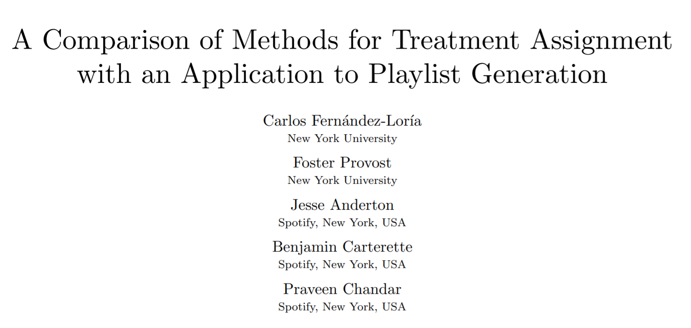

**Q:** 

- What problem was Spotify trying to solve? What question were they trying to answer?
- How did the team generate the data they use in the paper? Why might it matter?

***

*"We compare the three treatment assignment approaches using data from a massive, production A/B test. The A/B test produced a data set in which four different recommender systems were randomly assigned to users to build algorithmic playlists: three newly developed recommender systems and the system that was currently in production. More specifically, each observation corresponds to a user who selected a playlist, and each playlist was built using one of the four systems (chosen at random) to select and rank songs."*

***
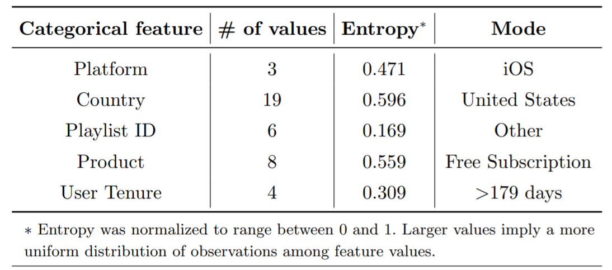

***
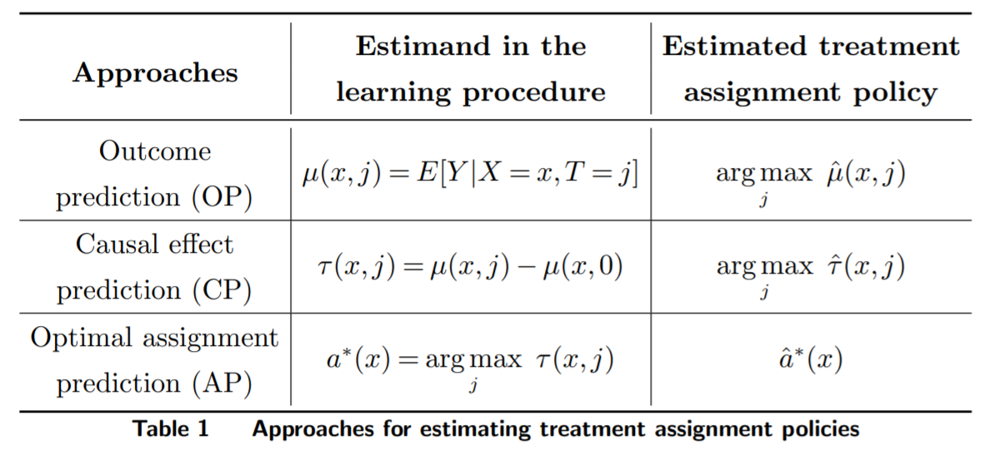

***
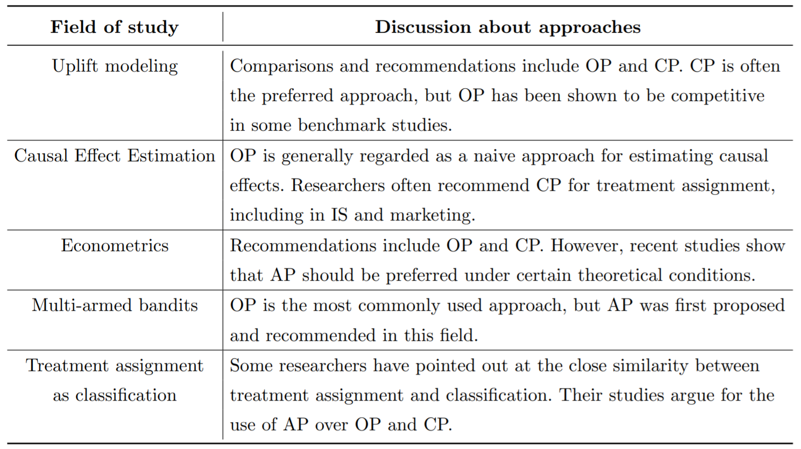

***
**R Demo: `MLForCI.Rmd`**

- Estimate CATE functions with ML
- Solve the treatment assignment problem

***

***
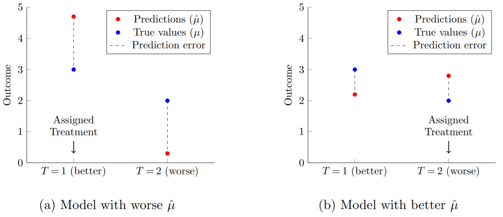

***

***
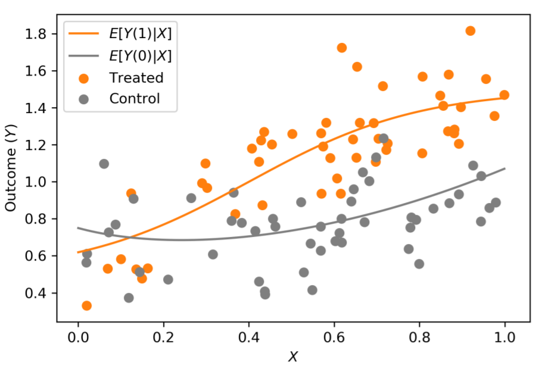

***
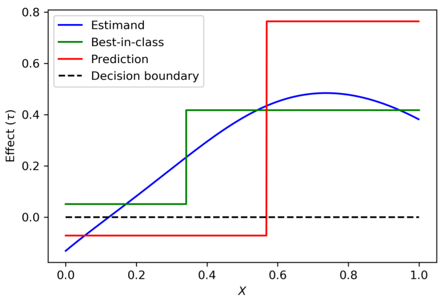

***
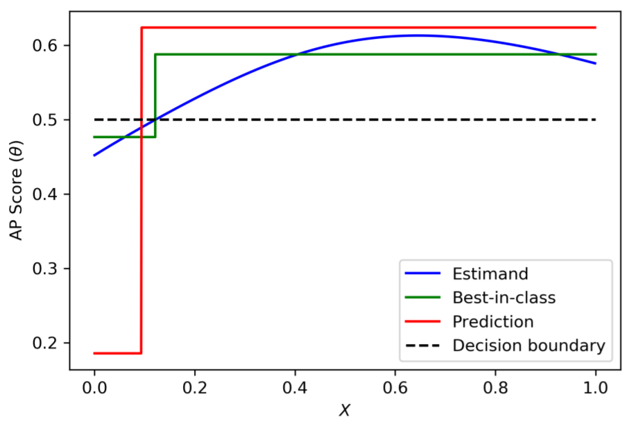

<!-- 
***
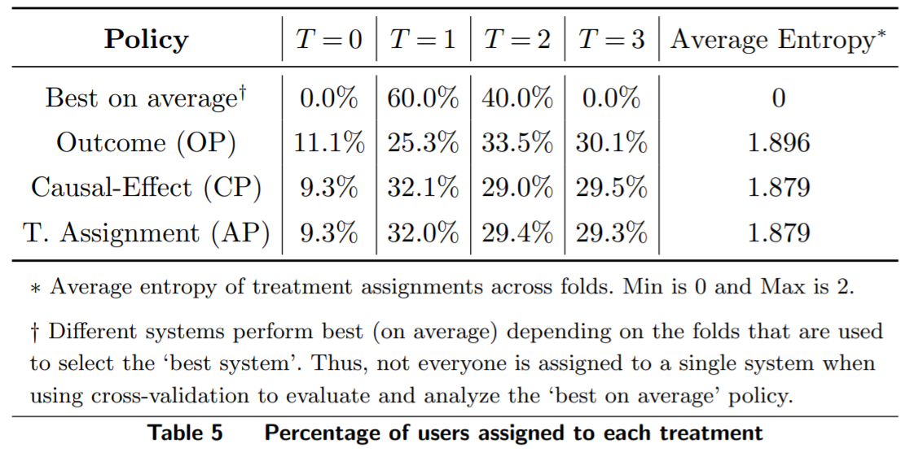 -->

***
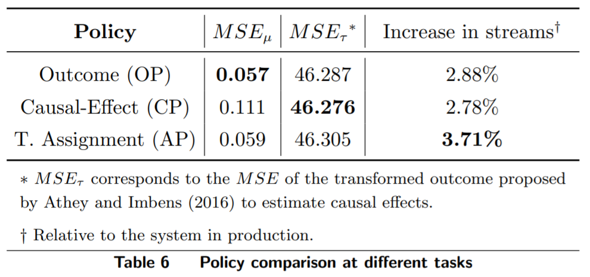

***
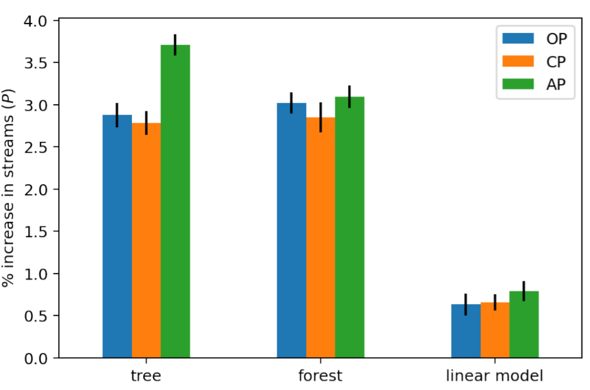

***
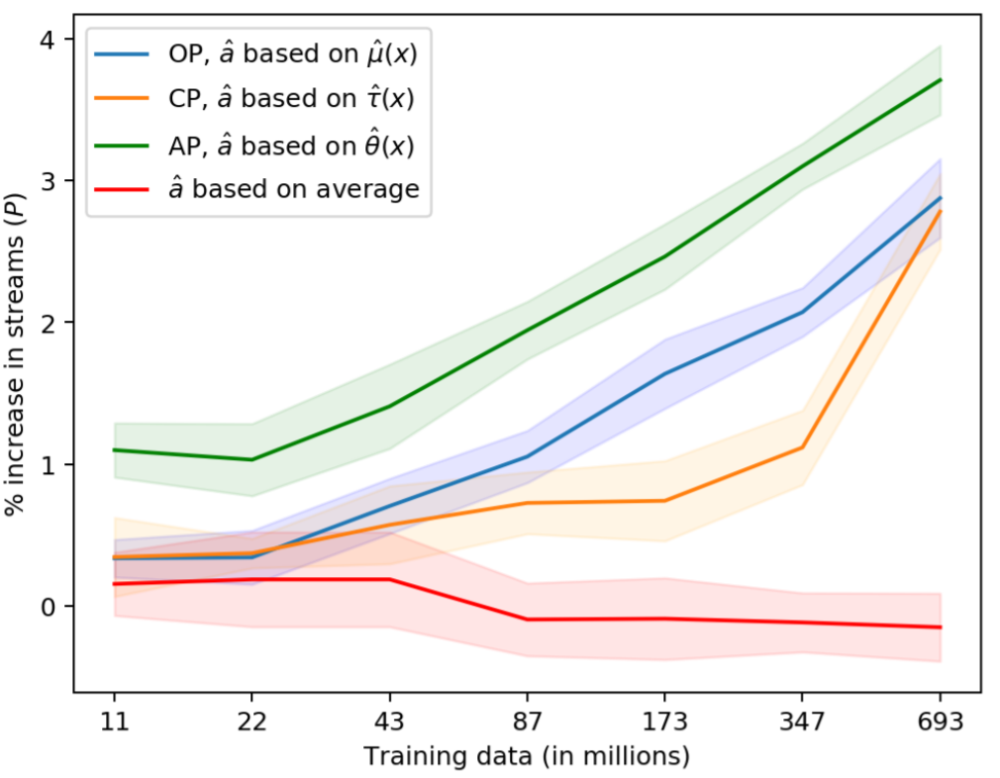

***
**CATE estimation with non-random data**

Estimating CATE with observational data is a harder problem.

- Double ML can be used to estimate a flexible treatment effect function instead of a fixed $\delta$:
$$Y_i - \hat f(X_i) = \alpha + \delta(X_i)(D_i - \hat g(X_i)) + \varepsilon_i$$
- But we need to be careful about all the usual concerns of unobserved confounders.
- There are also flexible IV based approaches (Deep IV, etc)

**Q:** What happens if units are very good at self-selecting into treatment?

<!-- # AI for Causal Inference?

***

**What do AI models know about causal relationships?**

This is a cutting edge research question with no clear answers yet. It relates to deep questions about how humans learn about causal relationships in the real world. -->

# What about AI for Causal Inference?

***
**Can AI help us with causal inference?**

An active area of research, but not much is known with confidence. Some possibilities that researchers are exploring:

- LLMs may contain useful information about *known* causal relationships learned from large corpora of text (e.g. Wikipedia, news articles, books, etc). This might help us identify potential confounders, mediators, or instruments.
- LLMs might be able to make inferences *unknown* causal relationships by combining pre-trained knowledge with reasoning about a specific context.
- Active reinforcement learning may allow agents to *learn* about casual relationships in the real world much like people do.

# Wrapping Up

***
**8 key lessons from this course:**

1. Causal Inference requires reasoning about *counterfactuals* which we can never directly observe.
2. If we have randomized treatment, we can estimate average causal effects by comparing mean outcomes in the treated and control groups.
3. When treatment is not random, *confounding* can create correlations between a treatment and outcome that are not driven by a direct causal relationship and bias our estimates.

***
3. With the right data, we can estimate average causal effects by controlling for a valid adjustment set with weighting, matching, regression, or ML-based approaches.
4. DAGs are a useful tool for deciding what variables you need to control for. You can use the Backdoor Criterion or more general Do-Calculus (by hand, or with an automatic solver) to identify valid adjustment sets.

***
5. When treatment assignment is chosen by strategic and forward looking agents, we should *always* worry about unobserved confounders.
6. When adjustment is not feasible, we can sometimes still estimate average causal effects with natural experiments and the appropriate research design (IV, RDD, DD, and more)

***
7. Sometimes it is not possible to convincingly estimate a causal effect.

***
8. Experiments with simulated data are a great way to test estimators and explore what causal effects can be estimated in different situations.

***
**Two broad strategies for causal inference:**

1. Start with a question, and answer it as best you can.
    - Often going to lead you towards running an experiment or adjusting based on observables
    - Randomization in treatment is extremely valuable. Even if you can't do a *perfect* experiment you might be able to use observational methods to control for remaining confounders.
2. Hunt for convincing natural experiments and see what questions they can answer
    - Common in social science where resources are scarce and direct interventions are often impossible
    - Might be an under-utilized strategy in industry

***

***Thanks for taking the class!***
