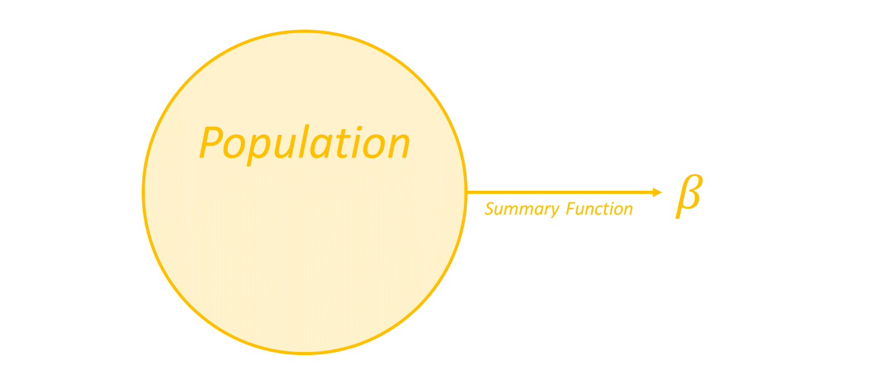
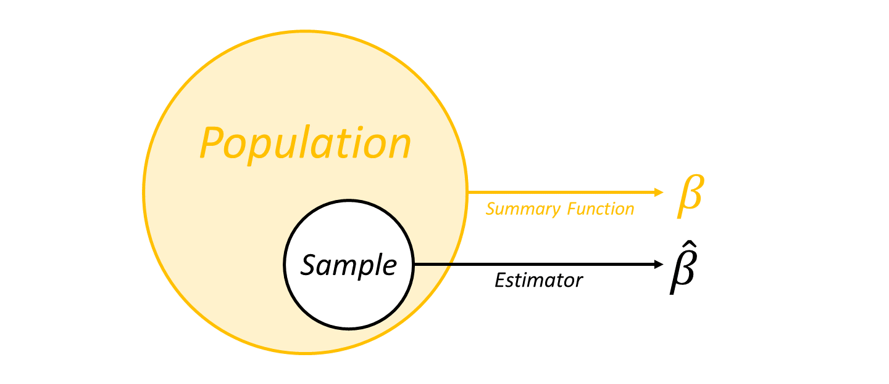
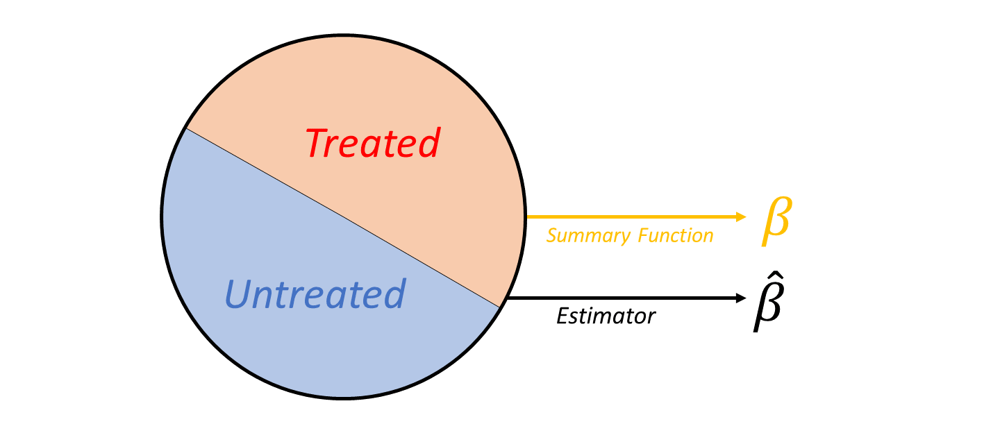

# Random Variables

***
A ***random variable*** is a quantity that can take different values in different states of the world.

We often write random variables as capital letters ($X$) and realized values in lower case ($x$).

***
The ***expected value*** of a random variable is the average of all the values taken by the variable in all states of the world.

We write $E[X]$ to indicate the expected value of $X$.

***
The **variance** of a random variable is the expected squared difference between the variable and its mean:
$$Var(X) = E[(X - E[X])^2]$$

The **standard deviation** of a random variable is the square root of its variance. It is often indicated with a greek "sigma":
$$\sigma_X = \sqrt{Var(X)}$$

***
The ***conditional expectation*** of a random variable is the average of all values taken by the variable in all the states of the world *where the condition is true*.

For example, we write $E[X|X>0]$ to indicate the expected value of $X$ across all states where $X>0$.

- We can also condition on other variables, as in $E[X|Z>0]$.
- When we want to condition on a variable taking a specific value, we can write $E[X|Z=z]$ or just $E[X|Z]$.

***
Two variables $X$ and $Z$ are defined as ***statistically independent*** if the probability of a particular combination of values occuring is equal to the product of the individual probabilities:
$$P(X,Z) = P(X)P(Z)$$

An important consequence of statistical independence is that learning the value of one provides no information about the value of the other:

$$E[X|Z] = E[X]$$

If learning the value of one variable *does* provide information about the other, we say that the variables are ***statistically dependant***.

***
***Correlation*** describes the degree to which a linear increase in one variable predicts a corresponding linear change in the other (though people often use the term more loosely as a synonym for any kind of statistical dependence). Two common measures are:

***Covariance***: $$Cov(X,Z) = E\Big[\big(X - E[X]\big)\big(Z - E[Z]\big)\Big]$$
***Pearson's Correlation Coefficient***:$$\rho_{X,Z} = \frac{Cov(X,Z)}{\sigma_X \sigma_Z}$$

# Estimation

***
**Estimation**

We often want to estimate a quantity with only partial information about its true value.

- We call a quantity we want to estimate an ***estimand***. 
- An ***estimator*** is any function that takes in data and produces an output that we can use as an ***estimate*** of an estimand. 

Notation:

- We often represent estimands with greek letters like $\beta$.
- To indicate an estimate of $\beta$, we add a "hat" like so: $\hat \beta$

***
Our estimand is usually some fixed value that summarizes something about a population.

***
...But we only observe a random sample of the population.

The random selection of the sample leads to a random estimate. This is known as ***Sampling Variation***.

***
Even if we observe the entire population, we only observe one potential outcome for each unit.

It is possible that different treatment assignments could lead to different estimates. This is known as ***Design-Based Variation***.

***
**Properties of Estimators**

Sampling and Design-based variation make an estimate a random variable.

- The ***Bias*** of an estimator is the expected difference between the estimate and the true parameter value:
$$Bias(\hat \beta) = E[\hat \beta - \beta]$$
- The ***Variance*** of an estimator describes how much the estimate changes across samples, regardless of bias:
$$Var(\hat \beta) = E \left[ (\hat \beta - E[\hat \beta])^2 \right]$$
- The ***Mean Squared Error*** of an estimator describes the overall "accuracy" of the estimator (in a specific sense):
$$MSE(\hat \beta) = E \left[ (\hat \beta - \beta)^2 \right]$$

***
**Consistency**

An estimator is ***Consistent*** if the MSE can be made arbitrarily small by increasing the sample size. 

Consistency is a very important property. We might be willing to accept some variance, or even bias in our estimator in small samples. But we want our estimator to become more precise when we have a large sample.

***
**Example: The most important estimator in statistics**

For a sample of $N$ observations $x_1, x_2, x_3, ... , x_N$ of a random variable $X$, the ***sample mean*** is defined as:
$$ \overline{X} = \frac{1}{N} \sum_{i=1}^{N} X_i = \frac{1}{N} \big ( X_1 + X_2 + X_3 + \dots + X_N \big )$$

The ***Law of Large Numbers*** is a theoretical result showing that, under mild assumptions about the statistical properties of $X$, the sample mean is an consistent estimator of the expected value $E[X]$.

# Confidence Intervals and Hypothesis Testing

***

*Note: Confidence intervals and hypothesis testing are important topics in statistics, but they are not meant to be a central focus in this course.*

*The following slides give a rough sketch of the key ideas.* 

***
**Asymptotic Normality**

An estimator is ***asymptotically normal*** if the distribution of estimates becomes arbitrarily close to a normal distribution as the sample size increases.

Many estimators are asymptotically normal (a consequence of the *Central Limit Theorem*).

***
When an estimator is unbiased and asymptotically normal, an estimate $\hat \beta_n$ with sample size $n$ will (approximately) follow a normal distribution with mean $\beta$ and variance  $\frac{\sigma_2}{n}$:
$$\hat \beta_n  \sim \mathcal N \left(\beta,\frac{\sigma_2}{n} \right) $$

This approximation becomes more precise as $N$ increases. For "large" $n$ therefore, we can say that:

1. The variance of our estimate will decrease at a rate of $1/n$
2. We can get a good approximation of the distribution of $\hat \beta_n$ by if we just know the ***standard error*** of our estimator: $$\frac{\sigma}{\sqrt{n}}$$.

***
**Estimating Standard Errors**

Estimating standard errors is just a another statistical estimation problem.

- For example, can talk about whether our standard errors are *biased*, or *consistent*.
- However, it is usually harder--both conceptually and in terms of the precision obtained from a given sample size--than the main parameter estimate.

***
Standard errors alone can be hard to interpret, so we often perform additional operations to examine the precision of our estimates.

1. We can use the standard error of an estimate to construct a *confidence interval* describing a range of likely values.
2. We can do formal *hypothesis testing* where we estimate the probability that the estimate could have been obtained by chance (under a particular set of assumptions referred to as the "*null hypothesis*")

***
**Confidence Intervals**

A (correctly calibrated) confidence interval is an pair of numbers defining an lower bound $\underline{c}$ and an upper bound $\overline{c}$ such that

$$P(\underline{c} \leq \delta \leq \overline{c}) = \alpha$$

Where $\alpha$ is some desired confidence level between 0 and 1.

We often speak of $\alpha$ as a percentage. For example, if $\alpha = 0.95$, we say that $\underline{c}$ and $\overline{c}$ define a 95% confidence interval.

***
**Estimating Confidence Intervals**

Confidence intervals can be constructed from the standard error estimate and the property of asymptotic normality. All we need to do is find the points on the normal distribution where a fraction $\alpha$ of the mass falls between $\underline{c}$ and $\overline{c}$

***
**Hypothesis Testing and P-values**

Another common approach to evaluating estimates is to ask: *If the true value of my parameter was 0, what is the probability that I would see a result as extreme as the one I observe?*

- This is equivalent to asking "*What $\alpha$-level confidence interval would just barely reach the observed estimate if we centered the interval around zero?*".
- The ***p-value*** is then the quantity $1 - \alpha$, which describes the probability that the estimate is further from zero than would be expected a fraction $\alpha$ of the time.
- Estimates with p-values smaller than some threshold (such as 0.05) are called ***statistically significant*** at the (5%) level.
- The condition "*If the true value of my parameter was 0*" in the above statement is called the ***null hypothesis***. Alternative null hypotheses are possible but less common.

***
**Statistical Power**

The $\alpha$-rate for confidence intervals and hypothesis tests tells us the fraction of times we are allowing the test to give us a *False Positive* (i.e., the true effect is zero, but it looks statistically significant)

We should also worry about the possibility of *False Negatives*, where the true effect is non-zero but the estimate is not statistically significant. If we call the rate of false negatives $\beta$, the *Power* of the test is $1-\beta$.

Power tells us about ability to detect real causal effects - how often will a "true" effect be statistically significant?

***
Statistical Power depends on:

1. Sample size (estimators become more precise with larger samples)
2. Fraction of treated observations (our precision is limited by the smaller sub-sample)
3. The amount of unexplained variation in $Y$ (more noise reduces precision)
4. Effect size (larger effects are easier to detect)

If you don't know your true effect size, you cannot know your statistical power! But if you are *designing* and experiment, you can use power calculations or (MC methods with simulated data) to estimate the sample size you would need to detect an effect of a given size.
