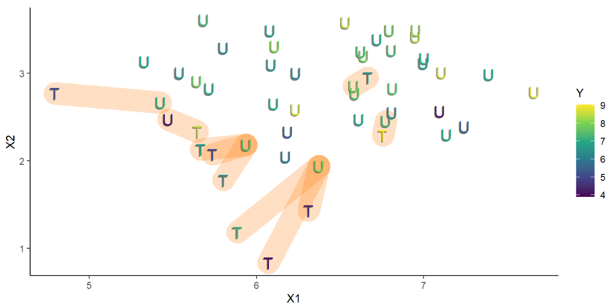

<link rel="stylesheet" type="text/css" href="http://tikzjax.com/v1/fonts.css">

**A Zoo of Algorithms**

People have invented many different algorithms for controlling for confounders. These slides attempt to summarize some of the key ideas behind the most common approaches.

# Post Stratification

***
**Post-Stratification**

Post-stratification is a simple way to control for covariates that describe discrete categories. The procedure is as follows:

1. Group the data into strata based on the values of the covariates (each stratum is a group of units with the same covariate values).
2. Compute the difference-in-means estimate for observations within each strata
3. Taking a weighted average of the difference-in-means estimates to construct the final estimate.

$$\Delta \overline Y_{PS} = \underbrace{\frac{1}{\sum_{s=1}^S w_s} \sum_{s=1}^S w_s \underbrace{ \left( \frac{1}{N_{T_s}}\sum_{i \in T_s} Y_i  - \frac{1}{N_{U_s}}\sum_{i \in U_s} Y_i \right) }_{\text{Difference-in-means for strata } s}}_{\text{ Weighted average of differences}}$$

***
**Post-Stratification Intuition**

Suppose the Conditional Independence Assumption holds for a set of covariates $X$.

If we stratify by $X$, then:

- The units in each strata have the same value of $X$, so differences in outcomes within each strata are unrelated to $X$.
- Within each strata we can use observed outcomes for one treatment group to estimate the counterfactual outcomes for the other treatment group without confounding (i.e., the difference-in-means estimator is unbiased).
- Because every strata difference-in-means estimate is unbiased, the overall estimate of the average treatment effect is also unbiased.

***
**Choosing the strata weights**

We can estimate different average treatment effects by choosing the strata weights to match the distribution of the units we are interested in:

- If we weight by the *total number of units* in each strata, we estimate the ATE
- If we weight by the *number of treated units* in each strata, we estimate the ATT
- If we weight by the *number of untreated units* in each strata, we estimate the ATU

***
**Post-Stratification as Weighting**

Post-stratification can also be viewed as a kind of *weighting estimator* where we construct individual unit weights such that:

1. The total weight on treated and untreated units in each strata is the same.
2. The total weight in each strata matches the target distribution we want to estimate.

And then compute the weighted difference-in-means as our final estimate.

# Matching Estimators

***
***Matching estimators*** compare the outcomes of selected pairs of treated and control observations.

The variables used to select the pairs are called ***matching covariates***.

- In ***exact matching***, we only allow matches between pairs of observations that share exactly the same covariate values
- In ***approximate matching*** we allow matches between pairs of observations that share *similar* covariate values.

***
**Choosing and Estimand**

Matching estimators can be used to estimate a variety of average treatment effects:

- To estimate the ATT, find one matched control for each treated unit
- To estimate the ATU, find one matched control for each untreated unit
- To estimate the ATE, find one matched control for every observed unit

***
**Approximate Matching**

The main limitation of exact matching is that the common support can be very small if you want to match on multiple covariates.

With continuous variables, there may be no exact matches in the data.

***Approximate Matching Estimators*** select control units that have *similar*, but not identical values for the matching covariates.

***
**Approaches to Approximate Matching**

There are many different approximate matching algorithms. Some popular approaches include:

- *Distance-based Matching*: Uses a mathematical measure of the distance between covariate values to select similar matches and discard observations that are too different to be matched.
- *Coarsened Exact Matching*: The researcher manually constructs groups of covariates which are allowed to match.
- *Propensity Score Matching*: Observations are matched on according to their predicted probability of being treated.

***
**Estimating the ATT with distance-based matching**

***
**Tradeoffs in Matching**

- Exact matching is often not feasible because only a tiny fraction of the data can be matched.
- Approximate matching allows us to find matches for a larger fraction of our sample observations.

Unfortunately, as soon as we relax the constraint that observations need to be matched exactly, we also introduce the potential for our estimator to be *biased*. After all, we are only *approximately* conditioning on the matching variables.

***
**Bias-Variance Trade-off**

Matching estimators force us to make fundamental trade-off between *bias* and *variance*.

In general, choosing more restrictive matches leads to:

- Better matched controls within sample $\rightarrow$ reduced estimator bias
- Smaller sample $\rightarrow$ higher estimator variance, reduced external validity

***
**Internal/External Validity Trade-off**

Observations that can be matched are often systematically different than those that are hard to match. If the treatment effects are different between the two groups, using more restrictive matching will:

- Reduce bias when estimating the treatment effect for matched observations (better internal validity)
- Potentially *increase* bias if we apply the estimate to the unmatched observations (poorer external validity)

***
**Matching as Weighting**

Matching can be interpreted as kind of weighting estimator where:

- Each observation is weighted according to the number of times it appears in a matched pair
- Observations outside of the common support are given zero weight

For example, using exact matching on a dataset with a handful of discrete covariates is roughly equivalent to post-stratification by those covariates (depending on how the matches are chosen).

# Propensity Score Methods

***
**Propensity Scores**
An important but non-obvious fact about causal inference is that it turns out we can control for all confounders simultaneously if we can control for the probability of treatment.

The treatment probability $P(D_i=1)$ is called a unit's *propensity score*.

***
**Intuition:** Confounding bias is only possible becuase the confounder alters the probability of treatment. Thus, comparing units with the same propensity score removes the confounding bias.

***
**Estimating Propensity Scores**

We rarely know the true probability of treatment for each unit. However, we can *estimate* the probability of treatment using observed covariates.

We can estimate propensity scores using any prediction algorithm that can produce continuous values. We just need to fit a model that predicts the probability of treatment as a function of observable characteristics.
$$\hat \pi_i = f(X_i)$$

This is commonly done with *logistic* or *probit* regression, since the target value is constrained to be between 0 and 1.

***
**Causal Inference with Propensity Scores**

Once we have estimated propensity scores, we can use them to estimate average treatment effects in two ways:

1. Propensity Score Matching
2. Inverse Propensity Score Weighting

***
**Propensity Score Matching**

Propensity Score Matching is a type of approximate matching where we match treated and untreated units based on their estimated propensity scores.

- To estimate the ATT, find one matched control for each treated unit
- To estimate the ATU, find one matched control for each untreated unit
- To estimate the ATE, find one matched control for every observed unit

In each case, we try to find a control unit with a propensity score that is as close as possible to the propensity score of the treated unit.

***
**Inverse Propensity Score Weighting**

Inverse Propensity Score Weighting (IPW) uses propensity scores to construct weights for each observation such that:

1. The total weight on treated and untreated units in each region of the propensity score is the same.
2. The total weight in each region matches the target distribution we want to estimate.

If the propensity scores have a small number of discrete values, this is equivalent to post-stratification by propensity score.

***
**Intuition via Post-Stratification**

Recall the formula for estimating the ATE with post-stratification:

$$\widehat{ATE} = \underbrace{\frac{1}{\sum_{s=1}^S N_s} \sum_{s=1}^S N_s \underbrace{ \left( \frac{1}{N_{T_s}}\sum_{i \in T_s} Y_i  - \frac{1}{N_{U_s}}\sum_{i \in U_s} Y_i \right) }_{\text{SDO for strata } s}}_{\text{ Weighted average of strata SDO estimates}}$$

- Treated observations are multiplied by $N_s/N_{T_s}$
    - (This is the inverse probability that a unit in strata $s$ is treated)
- Untreated observations are multiplied by $N_s/N_{U_s}$
    - (This is the inverse probability that a unit in strata $s$ is untreated)

Similar relationships exist if we are estimating the ATT or ATU.

***
**Choosing an Estimand**

Suppose $\hat \pi_i$ is the predicted propensity score for unit $i$. Then we can estimate the ATE, ATT, or ATU by weighting observations as follows:

| Estimand | Treated Weight | Control Weight | Explanation |
|---|:---:|:---:|---|
| | | | |
| ATE | $\frac{1}{\hat \pi_i}$ | $\frac{1}{1 - \hat \pi_i}$ | Inverse Propensity Score |
| | | | |
| ATT | $1$ | $\frac{\hat \pi_i}{1 - \hat \pi_i}$ | Re-Weight by $\hat \pi_i$ |
| | | | |
| ATU | $\frac{1 - \hat \pi_i}{\hat \pi_i}$ | $1$ | Re-Weight by $1 - \hat \pi_i$|
| | | | |

***
**Propensity Scores and Controlling for Observables**

Propensity Scores feel a bit like magic, but if you need to *estimate* them then they are actually just another way of conditioning on observable covariates.

Using a covariate $X$ to estimate the propensity score and then using the score for weighting is equivalent to controlling for $X$.
